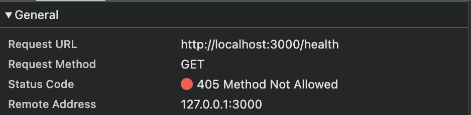

In this series, we are going to learn backend engineering using Axum, a web framework from Tokio team. We will build a single project that'll be a Medium API clone following the RealWorld API Spec --> https://github.com/gothinkster/realworld

This is our project's Github Repo Link --> https://github.com/0xshadow-dev/realworld-axum-api

By the end of this series you'd have built a Rest API backend using Axum and Rust with Authentication, testing, observability, CI/CD etc.

This series is completely hands-on series with each lesson having lots of code and we will implement something in each lesson.
## Prerequisites
- Rust programming language
- Basic backend concepts ( By backend concepts I mean: understanding what an HTTP request/response is, what a REST API looks like GET/POST/PUT/DELETE, and basic database usage like SELECT/INSERT. )
- Installed Rust
- Basic Git
- Installed Docker (If not, then please do we need it from next post)

This is going to be a long series, so let's get started.

In this post, we are going to setup our Axum backend project and create a simple `/health` endpoint. This will help us get a basic familiarity with Axum. So, let's start.

## Setting up the Project
Open up your terminal and in your preferred directory and let's create a new cargo project.

```bash
cargo new realworld-axum-api
cd realworld-axum-api
```
This create a basic Rust project with a simple Hello World program in the `src/main.rs` file.

If you'll open the `main.rs` file, you'll see the basic Hello World program.
```rust
fn main() {
    println!("Hello, world!");
}
```
For this post, we are going to modify this `main.rs` file and convert this from a "Hello World!" program to a web server.

## Add Dependencies
Ok, now we need to add dependencies to build our basic server. We might add more dependencies in the future but for now the following 3 are enough.
```toml
[package]
name = "realworld-axum-api"
version = "0.1.0"
edition = "2021"

[dependencies]
axum = "0.8"
tokio = { version = "1.0", features = ["full"] }
serde_json = "1.0"
```
I'll explain what we added and why but this is how our `Cargo.toml` file would look like. So, either copy paste the entire thing or just add those dependencies in your `Cargo.toml` file.

- We added `axum` as this is the web framework that we are going to use to build our API
- In this case, we need to add `tokio` as `axum` is built on top of `tokio`. So, we need both.
- Finally, we added `serde_json`, this will help us to create JSON responses as we will return or send JSON responses from our API.

Ok, so now we can start working on building our first basic web server in rust as we are done with adding all the dependencies we need.

## Creating Our First Web Server in Axum
Let me first give you the entire code here, then I'll explain everything in detail. From next post onwards I'll give you the github repo from where you can get the source code as we will start working with multiple files and slowly the lines of code will become a lot.

```rust
use axum::{response::Json, routing::get, Router};
use serde_json::{json, Value};

#[tokio::main]
async fn main() {
    let app = Router::new().route("/health", get(health_check));

    let listener = tokio::net::TcpListener::bind("0.0.0.0:3000").await.unwrap();
    println!("Server is running on http://0.0.0.0:3000");
    axum::serve(listener, app).await.unwrap();
}

async fn health_check() -> Json<Value> {
    Json(json!({
        "status": "ok",
        "message": "Server is running"
    }))
}
```

Ok, let's now understand everything
## Imports
```rust
use axum::{response::Json, routing::get, Router};
use serde_json::{json, Value};
```
- We need `response::Json` to send data as JSON in Axum.
- We are using `routing::get` for our get endpoints.
- The `Router` is used to map endpoints to methods.
- Finally we are using `serde_json::{json, Value}` as these lets us create JSON objects easily and `Value` is a type that can hold any JSON data (objects, arrays, strings, numbers).
If you are confused then don't worry you'll understand their use once you understand the entire code.

## The Main Function Signature

We need to understand this part clearly to make sense of tokio, async, concurrency and parallelism.

```rust
#[tokio::main]
async fn main() {
```

### What is Tokio and Why Do We Need It?

Tokio is an async runtime that allows us to do async operations in Rust. But what does that actually mean?

To understand that, let's understand what synchronous programming does.
#### Synchronous Programming

Here, our program executes one instruction at a time. Let's understand this with a simple pseudocode.

```rust
// Synchronous pseudocode
fn handle_request() {
    let data = read_from_database();     // Takes 50ms, program waits
    let result = process_data(data);     // Takes 10ms, program waits
    send_response(result);               // Takes 5ms, program waits
}
// Total time: 65ms per request
```

Here, it first reads from the database, then processes the data and finally sends a response. All this takes around 65ms. Note that this is only for 1 request.

The problem is if you get 1000 requests, they are handled one after another:

- Request 1: 0ms - 65ms
- Request 2: 65ms - 130ms
- Request 3: 130ms - 195ms
- Request 1000: 64,935ms - 65,000ms (over 1 minute!)

This is terrible for web servers.

#### Asynchronous Programming

With async programming, when you hit a "waiting" operation (like database calls, file I/O, network requests), our program can pause that function and work on something else:

```rust
// Async version
async fn handle_request() {
    let data = read_from_database().await;    // Pauses here, lets other work happen
    let result = process_data(data);          // CPU work, no pausing needed
    send_response(result).await;              // Pauses here, lets other work happen
}
```

While one request is waiting for the database, we can start processing other requests:

```
Time: 0ms
├─ Request 1: starts database call (will take 50ms)
├─ Request 2: starts database call (will take 50ms)
├─ Request 3: starts database call (will take 50ms)

Time: 50ms
├─ Request 1: database done, continues processing
├─ Request 2: database done, continues processing
├─ Request 3: database done, continues processing
```

All 1000 requests could potentially complete in just slightly over 65ms instead of 65 seconds!

#### What Makes Operations "Waiting"?

Waiting operations are anything that involves going outside our CPU to get data:

- **Network calls** (HTTP requests, database queries)
- **File I/O** (reading/writing files)
- **Database operations** (SELECT, INSERT, etc.)

But why they're "waiting" operations?

##### Why they're "waiting"?
 Our CPU can only work with data in RAM. When data is anywhere else (disk, network, database), our CPU physically waits for it to be fetched. During this waiting time, async lets our CPU work on other requests instead of sitting idle.

In our current server we don't do waiting operations in our handler, but the server framework does (waiting for new connections, reading request data, sending responses).

> **Note:** **Concurrency** means dealing with multiple tasks at once (like juggling), while **Parallelism** means actually executing tasks simultaneously (like multiple people working). Tokio provides both - concurrency within threads and parallelism across CPU cores. Web servers primarily need concurrency because most time is spent waiting for I/O, not doing CPU-intensive work.

### Why Tokio Macro is Necessary
Rust's standard `main` function is synchronous by default:

```rust
fn main() {
    // This is a synchronous context
    // You cannot use .await here
    // You cannot call async functions directly
}
```

But we need async capabilities for our web server. The Tokio macro enables it to be async.
## Creating the Router
```rust
let app = Router::new()
    .route("/health", get(health_check));
```
We are creating a routing table, that'll map our URLs to functions like `/health` to `health_check` function.

So, `Router::new()` creates an empty router with no routes defined. Then we use `.route("/health", get(health_check))` method to add a `/health` route that can only support ` GET` method and when a user will request the `/health` endpoint with a `GET` method, our router to call the `health_check` function and returns whatever the function returns.

> If you'll change the `get(health_check)` to `post(health_check)` and restart the server and request  `http://localhost:3000/health` in your browser. You'll see it'll fail.
> To check the reason, open the Network tab and you'll the server will return with a status of Method Not Allowed. 

## Network Binding
```rust
let listener = tokio::net::TcpListener::bind("0.0.0.0:3000")
    .await
    .unwrap();
```
Here, we are creating a listener that'll actually receive HTTP requests on port `3000`. We are using the port 3000 as this is a common development port.

## Starting the Server
```rust
println!("Server running on http://0.0.0.0:3000");
axum::serve(listener, app).await.unwrap();
```
First, we are just printing a message that'll say that the server is running.
Then it actually starts the server loop.

The `axum::serve(listener, app)` uses `listener` to get the actual socket where it receives the HTTP requests and it also uses `app` as that's our router who knows how to handle those requests like `/health` should execute the `health_check` function.

## The Handler Function
```rust
async fn health_check() -> Json<Value> {
    Json(json!({
        "status": "ok",
        "message": "Server is running"
    }))
}
```
This function defines what will happen when our router will call `health_check` function for the endpoint `/health`.
We call these kind of functions as handlers and we are making this function an async function so that it can be paused or resumed, allowing other request to be processed while this one runs.

- `Json<Value>` is the return type and it means, return JSON data and the JSON can contain any valid JSON value(object, array, string, number, boolean, null).
- `Json(...)` is a wrapper that tells Axum to set the `Content-Type: application/json` header, serialize the data to JSON string and set appropriate HTTP status.
- `json!({...})` is a macro that creates a JSON object.

## Testing Our Basic Server
Let's start our server using the following command:
```rust
cargo run
```
You should see
```bash
Server running on http://0.0.0.0:3000
```
Now, open another terminal and run:
```bash
curl http://localhost:3000/health
```
You should see a JSON response:
```json
{"message":"Server is running","status":"ok"}
```

Now, let's understand what happened when we made that request.
When we run `curl http://localhost:3000/health`, here's what happens:
1. The TCP listener receives the HTTP request
2. Axum parses it into method=GET, path="/health"
3. Router looks up "/health" + GET and finds `health_check`
4. `health_check()` function runs
5. `Json(...)` wrapper creates proper HTTP response
6. Response is sent back through the TCP connection

## Conclusion
Congratulations on building your first Axum web server. In this post, we understood a lot of things like setting up a basic Axum project, fundamentals of async programming and how its important for web servers, how to create routes and handlers and finally the complete request-response flow.

In the next post, we are going to add PostgreSQL database, we will learn and use Docker to set that up, we will create a proper project structure with multiple modules and create a database health check. See you soon.
