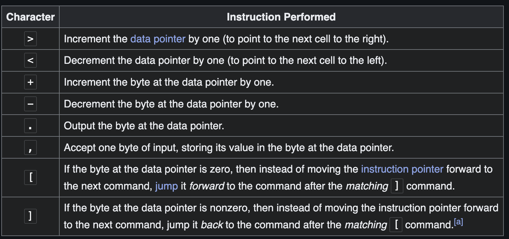
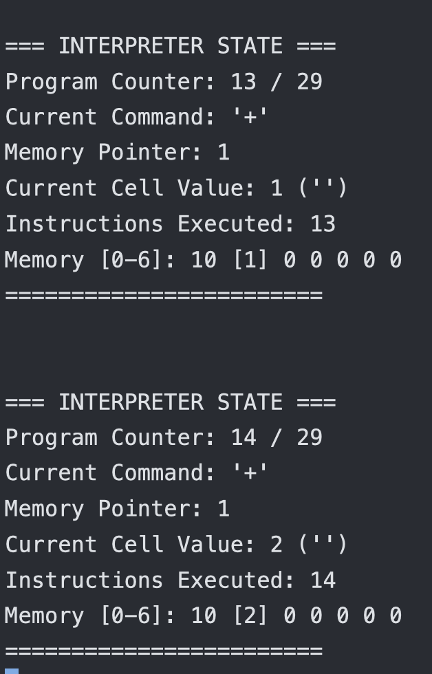

In this post, we are not only going to understand the brainfuck language but we will also build an interpreter for brainfuck using Rust programming language. I'm really excited about it, lets get right into it

## Prerequisites
- Rust programming language
- I won't explain any rust concepts, if you don't know a certain concept, then please learn it from some other resource and continue reading.

## Introduction to Brainfuck
It was created by a person named Urban Muller in 1993 and he created it as an experiment to create the smallest possible compiler for a programming language. It has only 8 commands and that's what makes it minimalist.

Ok, let me just show you an example code and you'll understand why the name suits it really well.
```brainfuck
++++++++[>++++[>++>+++>+++>+<<<<-]>+>+>->>+[<]<-]>>.>---.+++++++..+++.>>.<-.<.+++.------.--------.>>+.
```
This is what a simple hello world program looks like. I find it really cool to be honest.

It might look really weird but i promise you'll be able to read and write and create an interpreter for it by the end of this long post.

### The 8 Commands Overview
We will cover each of these commands and how to use them but for now, I'm just giving you an overview of these commands.



## How Brainfuck Programs Work
Every Brainfuck program operates on:
- An array of memory cells(initially all set to 0)
- A pointer that starts at the first memory cell
- The program instructions read one by one


> Any character that isn't one of these 8 commands is completely ignored. This means you can add comments or spaces anywhere in your code.


## The Tape (Memory Array)
Brainfuck uses what's called a "tape", think of it as an array of memory cells. each cell can store a number (typically between 0-255, which represents 1 byte).
```
Memory Cells:  [0] [0] [0] [0] [0] [0] [0] [0] [0] ...
Cell Numbers:   0   1   2   3   4   5   6   7   8  ...
```
There are somethings that we should note about the tape:
- All the cells start with the value 0
- Each of those cells can hold a number from 0 to 255
- The tape is theoretically infinite but in practice, our computer's memory is the limit.
- If we try to put values like 256 or -1, it'll wrap around to 0 and 255 respectively.

## The Pointer
If you are coming from a language like c/c++, you can easily guess what it does. But for the rest of us, the pointer tells us which memory cell we're currently working with. It starts from position 0(the first cell)
```
Memory Cells:  [0] [0] [0] [0] [0] [0] [0] [0] [0] ...
                ^
              Pointer starts here (position 0)
```

## How the Pointer Moves
The `>` command moves the pointer right:
```
Before >:      [0] [0] [0] [0] [0] ...
                ^
After >:       [0] [0] [0] [0] [0] ...
                   ^
```
The `<` command moves the pointer left:
```
Before <:      [0] [0] [0] [0] [0] ...
                   ^
After <:       [0] [0] [0] [0] [0] ...
                ^
```

## How Values Change
The `+` command adds 1 to the current cell:
```
Before +:      [0] [5] [0] [0] [0] ...
                   ^
After +:       [0] [6] [0] [0] [0] ...
                   ^
```
The `-` command subtracts 1 from the current cell:
```
Before -:      [0] [6] [0] [0] [0] ...
                   ^
After -:       [0] [5] [0] [0] [0] ...
                   ^
```

## Let's Trace Through a Simple Example
Let's follow this code step by step: `+++>++`

**Initial state:**
It'll keep all the cell values as 0 and point to the first cell.
```
Memory:   [0] [0] [0] [0] [0] ...
           ^
         Pointer
```

**After first `+`:**
It'll increment the first cell value from 0 to 1 due to the `+` command
```
Memory:   [1] [0] [0] [0] [0] ...
           ^
         Pointer
```

**After second `+`:**
It'll increment the value from 1 to 2.
```
Memory:   [2] [0] [0] [0] [0] ...
           ^
         Pointer
```

**After third `+`:**
Incrementing value from 2 to 3
```
Memory:   [3] [0] [0] [0] [0] ...
           ^
         Pointer
```

**After `>`:**
The pointer wil point to the next cell i.e. the 2nd cell of the tape
```
Memory:   [3] [0] [0] [0] [0] ...
               ^
             Pointer
```

**After first `+` (in new position):**
It'll increment the value of 2nd cell from 0 to 1
```
Memory:   [3] [1] [0] [0] [0] ...
               ^
             Pointer
```

**After second `+`:**
Incrementing the value from 1 to 2
```
Memory:   [3] [2] [0] [0] [0] ...
               ^
             Pointer
```

I hope with this walkthrough you have a basic understanding of how the pointer moves, now it's time to dive deep into all the 8 commands and understand them in this clear way.

## Brainfuck Commands Explained

Let's understand each command clearly with examples. I'll show you exactly what happens to memory and the pointer with each one.

## Movement Commands

### `>` - Move Pointer Right

It moves the memory pointer one position to the right.

**Example:**

```
Before:   [3] [7] [0] [0] [0] ...
               ^
After >:  [3] [7] [0] [0] [0] ...
                   ^
```

### `<` - Move Pointer Left

It moves the memory pointer one position to the left.

**Example:**

```
Before:   [3] [7] [0] [0] [0] ...
                   ^
After <:  [3] [7] [0] [0] [0] ...
               ^
```

## Value Modification Commands

### `+` - Increment Current Cell

It adds 1 to the value in the current cell.

**Example:**

```
Before:   [3] [7] [0] [0] [0] ...
               ^
After +:  [3] [8] [0] [0] [0] ...
               ^
```

**Wrapping behavior:**
In the example we are increment the 2nd cell that already has a value of 255. As I explained before if you'll increment after having a value of 255, it'll wrap and become 0.
```
Before:   [3] [255] [0] [0] [0] ...
               ^
After +:  [3] [0] [0] [0] [0] ...
               ^
```

### `-` - Decrement Current Cell

It subtracts 1 from the value in the current cell.

**Example:**

```
Before:   [3] [7] [0] [0] [0] ...
               ^
After -:  [3] [6] [0] [0] [0] ...
               ^
```

**Wrapping behavior:**
Again, the same wrapping concept, if you are decrementing the value 0, it'll become 255
```
Before:   [3] [0] [0] [0] [0] ...
               ^
After -:  [3] [255] [0] [0] [0] ...
               ^
```

## Input/Output Commands

### `.` - Output Current Cell

It takes the number in the current cell and outputs it as a ASCII character
- Each number (0-255) represents a character in ASCII
- For example: 65 = 'A', 66 = 'B', 72 = 'H', 32 = space

**Example:**
If your pointer is pointing at 2nd cell and the interpreter reads the command `.`, it'll print the ASCII value of the 2nd cell
```
Memory:   [3] [72] [0] [0] [0] ...
               ^
Command: .
Output: H    (because 72 is ASCII for 'H')
```

### `,` - Input Character

It reads one character from input and stores its ASCII value in the current cell.

**Example:**
If your pointer is pointer at 3rd cell and the user inputs a ASCII character for example 'A', then it'll store the ASCII value of that character in the 3rd cell(current cell).
```
Before:   [3] [72] [0] [0] [0] ...
                    ^
User types: A
After ,:  [3] [72] [65] [0] [0] ...
                    ^
```

(65 is the ASCII value of 'A')

## Loop Commands

Brainfuck loops are conditional structures that repeat code blocks based on the current cell's value. They work as a pair: `[` starts a loop and `]` ends it.

### `[` - Loop Start (Jump Forward if Zero)

The `[` command checks the current cell value:

- **If the cell is 0:** Jump forward past the matching `]` (skip the loop entirely)
- **If the cell is non-zero:** Continue to the next instruction (enter the loop)

**Example 1 - Skip loop (current cell is 0):**

```
Memory:   [3] [0] [8] [0] [0] ...
               ^
Code:     + + + [ - - - ] + +
               ^           ^
               |           |
           Skip to here because cell is 0
```

**Example 2 - Enter loop (current cell is not 0):**

```
Memory:   [3] [5] [8] [0] [0] ...
               ^
Code:     + + + [ - - - ] + +
               ^   ^
               |   |
           Cell ≠ 0, so continue here
```

### `]` - Loop End (Jump Backward if Not Zero)

The `]` command also checks the current cell value:

- **If the cell is non-zero:** Jump back to the instruction _after_ the matching `[` (repeat the loop)
- **If the cell is 0:** Continue to the next instruction (exit the loop)

**Example 1 - Repeat loop (current cell is not 0):**

```
Memory:   [3] [2] [8] [0] [0] ...
               ^
Code:     + + + [ - - - ] + +
                   ^     ^
                   |     |
              Jump back to here because cell ≠ 0
```

**Example 2 - Exit loop (current cell is 0):**

```
Memory:   [3] [0] [8] [0] [0] ...
               ^
Code:     + + + [ - - - ] + +
                         ^     ^
                         |     |
                Cell = 0, so continue here
```

## How Loops Work Together

Brainfuck loops create **while loops** in traditional programming terms. The pattern is: "while the current cell is not zero, do this block of code."

### Simple Loop Example

Let's trace through a complete loop: `+++[-]`

This code increments a cell 3 times, then decrements it until it reaches 0.

```
Initial:  Memory: [0] [0] [0] ...   Pointer: 0

Step 1-3: +++     Memory: [3] [0] [0] ...   (add 3 to cell 0)

Step 4:   [       Memory: [3] [0] [0] ...   (3 ≠ 0, enter loop)
Step 5:   -       Memory: [2] [0] [0] ...   (subtract 1)
Step 6:   ]       Memory: [2] [0] [0] ...   (2 ≠ 0, jump back after [)

Step 7:   -       Memory: [1] [0] [0] ...   (subtract 1)
Step 8:   ]       Memory: [1] [0] [0] ...   (1 ≠ 0, jump back after [)

Step 9:   -       Memory: [0] [0] [0] ...   (subtract 1)
Step 10:  ]       Memory: [0] [0] [0] ...   (0 = 0, exit loop)

Final:    Memory: [0] [0] [0] ...   (cell 0 is now zero)
```

This loop is a "clear cell" pattern - it sets the current cell to 0 regardless of its initial value.

### Common Loop Patterns
So, when I first tried to learn loop in Brainfuck I couldn't really understand how to make use of it. Then I looked it up and got to know some common patterns. I'm listing some of them down below, you can find more by yourself.

- **Clear cell:** `[-]` - Sets current cell to 0
- **Copy cell:** `[>+<-]` - Copies current cell to next cell (destroys original)
- **Move cell:** `[>+<-]` - Same as copy, moves value to next cell
- **Add cells:** `[->+<]` - Adds current cell to next cell


Now that you understand all the commands, let's write a simple Brainfuck program to see how they work together before building our interpreter.

## Example Program: Output 'A'

Let's create a program that outputs the letter 'A' (ASCII 65). We'll use a loop to make it efficient:

**Code:** `++++++++++[>++++++<-]>+++++.`

Let's trace through this step by step:

```
Initial:    Memory: [0] [0] [0] ...   Pointer: 0

Step 1-10:  ++++++++++    Memory: [10] [0] [0] ...   Pointer: 0   (add 10 to cell 0)

Step 11:    [                           Memory: [10] [0] [0] ...   Pointer: 0   (10 ≠ 0, enter loop)
Step 12:    >                         Memory: [10] [0] [0] ...   Pointer: 1   (move right)
Step 13-18: ++++++           Memory: [10] [6] [0] ...   Pointer: 1   (add 6 to cell 1)
Step 19:    <                         Memory: [10] [6] [0] ...   Pointer: 0   (move left)
Step 20:    -                         Memory: [9] [6] [0] ...    Pointer: 0   (subtract 1)
Step 21:    ]                          Memory: [9] [6] [0] ...    Pointer: 0   (9 ≠ 0, jump back after [)

Step 22:    >                        Memory: [9] [6] [0] ...    Pointer: 1   (move right)
Step 23-28: ++++++         Memory: [9] [12] [0] ...   Pointer: 1   (add 6 to cell 1)
Step 29:    <                        Memory: [9] [12] [0] ...   Pointer: 0   (move left)
Step 30:    -                         Memory: [8] [12] [0] ...   Pointer: 0   (subtract 1)
Step 31:    ]                          Memory: [8] [12] [0] ...   Pointer: 0   (8 ≠ 0, jump back after [)

... (8 more loop iterations) ...

After loop: Memory: [0] [60] [0] ...   Pointer: 0   (loop finished: 10 × 6 = 60)

Step 32:    >             Memory: [0] [60] [0] ...   Pointer: 1   (move to cell 1)
Step 33-37: +++++         Memory: [0] [65] [0] ...   Pointer: 1   (add 5: 60 + 5 = 65)
Step 38:    .             Memory: [0] [65] [0] ...   Pointer: 1   Output: A
```

1. First, we set the first cell value to 10
2. Then, we used a loop to multiply: 10 × 6 = 60 in cell 1
3. Then, we added 5 more to get 65 (ASCII for 'A')
4. Finally, we output the character


Ok, let's start working on our Brainfuck interpreter project in Rust.

## Creating the Project

Let's open our terminal and create a new rust project:

```bash
cargo new brainfuck_interpreter
cd brainfuck_interpreter
```

This will create a new rust project with a basic project structure.

Before building this project, let's understand the different components of this project that we need to build. So that in the end we will integrate all these components and our interpreter project will be over.

## The Core Components We Need

- **Memory Tape:** The array of cells where data is stored
- **Memory Pointer:** Which cell we're currently looking at
- **Program:** A brainfuck code (for example a hello world code) to test our interpreter
- **Program Counter:** This will track which command we're currently executing
- **Execution Loop:** The engine that reads and executes commands

Let me give you the entire code here and then we will understand the entire code in detail.
```rust
use std::env;
use std::fs;
use std::io::{self, Read, Write};
use std::path::Path;


#[derive(Debug)]
struct BrainfuckInterpreter {

    memory: Vec<u8>,
    memory_pointer: usize,
    program: Vec<char>,
    program_counter: usize,
    bracket_map: Vec<usize>,
    instructions_executed: usize,
}


impl BrainfuckInterpreter {

    fn new() -> Self {
        BrainfuckInterpreter {
            memory: vec![0; 30000],
            memory_pointer: 0,
            program: Vec::new(),
            program_counter: 0,
            bracket_map: Vec::new(),
            instructions_executed: 0,
        }
    }


    fn load_from_file(&mut self, filename: &str) -> Result<(), String> {

        if !Path::new(filename).exists() {
            return Err(format!("File '{}' not found!", filename));
        }


        let source_code = fs::read_to_string(filename)
            .map_err(|e| format!("Error reading file '{}': {}", filename, e))?;

        println!("Successfully loaded file: {}", filename);
        println!("File size: {} bytes", source_code.len());


        self.load_program(&source_code)?;

        Ok(())
    }


    fn load_program(&mut self, source_code: &str) -> Result<(), String> {

        self.program = source_code
            .chars()
            .filter(|&c| "+-<>[].,".contains(c))
            .collect();

        println!(
            "Filtered {} characters down to {} valid commands",
            source_code.len(),
            self.program.len()
        );

        if self.program.len() > 0 {
            let preview_len = 50.min(self.program.len());
            let preview: String = self.program[..preview_len].iter().collect();
            println!(
                "Command preview: {}{}",
                preview,
                if self.program.len() > 50 { "..." } else { "" }
            );
        }


        self.build_bracket_map()?;


        self.program_counter = 0;
        self.instructions_executed = 0;

        println!("Program loaded and ready to execute!");
        Ok(())
    }

    fn build_bracket_map(&mut self) -> Result<(), String> {

        self.bracket_map = vec![0; self.program.len()];


        let mut bracket_stack = Vec::new();

        for (position, &command) in self.program.iter().enumerate() {
            match command {
                '[' => {

                    bracket_stack.push(position);
                }
                ']' => {

                    if let Some(matching_open) = bracket_stack.pop() {
                        // Create bidirectional mapping
                        self.bracket_map[matching_open] = position; // '[' -> ']'
                        self.bracket_map[position] = matching_open; // ']' -> '['
                    } else {
                        return Err(format!(
                            "Unmatched closing bracket ']' at position {}",
                            position
                        ));
                    }
                }
                _ => {} // Ignore other commands
            }
        }

        // Check for unmatched opening brackets
        if !bracket_stack.is_empty() {
            return Err(format!(
                "Unmatched opening bracket '[' at position {}",
                bracket_stack[0]
            ));
        }

        println!("Bracket mapping completed successfully!");
        Ok(())
    }


    fn run(&mut self) -> Result<(), String> {
        println!("\n=== STARTING PROGRAM EXECUTION ===");

        if self.program.is_empty() {
            return Err("No program loaded!".to_string());
        }

        while self.program_counter < self.program.len() {
            let command = self.program[self.program_counter];


            self.execute_command(command)?;


            self.program_counter += 1;
            self.instructions_executed += 1;

            if self.instructions_executed > 100_000_000 {
                return Err(
                    "Program exceeded maximum instruction limit (100M instructions)".to_string(),
                );
            }
        }

        println!("\n=== PROGRAM EXECUTION COMPLETED ===");
        println!(
            "Total instructions executed: {}",
            self.instructions_executed
        );
        Ok(())
    }


    fn execute_command(&mut self, command: char) -> Result<(), String> {
        match command {
            '>' => {

                self.memory_pointer += 1;
                // Expand memory if needed
                if self.memory_pointer >= self.memory.len() {
                    self.memory.resize(self.memory_pointer + 1000, 0);
                }
            }

            '<' => {

                if self.memory_pointer == 0 {
                    return Err("Memory pointer moved below zero!".to_string());
                }
                self.memory_pointer -= 1;
            }

            '+' => {

                self.memory[self.memory_pointer] = self.memory[self.memory_pointer].wrapping_add(1);
            }

            '-' => {

                self.memory[self.memory_pointer] = self.memory[self.memory_pointer].wrapping_sub(1);
            }

            '.' => {

                let character = self.memory[self.memory_pointer] as char;
                print!("{}", character);
                io::stdout().flush().unwrap();
            }

            ',' => {

                print!("Input: ");
                io::stdout().flush().unwrap();

                let mut buffer = [0u8; 1];
                match io::stdin().read_exact(&mut buffer) {
                    Ok(()) => {
                        self.memory[self.memory_pointer] = buffer[0];
                    }
                    Err(_) => {

                        self.memory[self.memory_pointer] = 0;
                    }
                }
            }

            '[' => {

                if self.memory[self.memory_pointer] == 0 {
                    self.program_counter = self.bracket_map[self.program_counter];
                }
            }

            ']' => {

                if self.memory[self.memory_pointer] != 0 {
                    self.program_counter = self.bracket_map[self.program_counter];
                }
            }

            _ => {

                return Err(format!("Invalid command: '{}'", command));
            }
        }

        Ok(())
    }

    // DEBUGGING: Show current interpreter state
    fn debug_state(&self) {
        println!("\n=== INTERPRETER STATE ===");
        println!(
            "Program Counter: {} / {}",
            self.program_counter,
            self.program.len()
        );

        if self.program_counter < self.program.len() {
            println!("Current Command: '{}'", self.program[self.program_counter]);
        }

        println!("Memory Pointer: {}", self.memory_pointer);
        println!(
            "Current Cell Value: {} ('{}')",
            self.memory[self.memory_pointer], self.memory[self.memory_pointer] as char
        );

        println!("Instructions Executed: {}", self.instructions_executed);


        let start = if self.memory_pointer >= 5 {
            self.memory_pointer - 5
        } else {
            0
        };
        let end = (self.memory_pointer + 6).min(self.memory.len());

        print!("Memory [{}-{}]: ", start, end - 1);
        for i in start..end {
            if i == self.memory_pointer {
                print!("[{}] ", self.memory[i]);
            } else {
                print!("{} ", self.memory[i]);
            }
        }
        println!("\n========================");
    }


    fn run_debug(&mut self) -> Result<(), String> {
        println!("\n=== STARTING DEBUG MODE ===");
        println!("Press Enter to execute each command, 'q' to quit");

        while self.program_counter < self.program.len() {
            self.debug_state();


            let mut input = String::new();
            io::stdin().read_line(&mut input).unwrap();

            if input.trim() == "q" {
                println!("Debug mode terminated by user.");
                return Ok(());
            }


            let command = self.program[self.program_counter];
            self.execute_command(command)?;
            self.program_counter += 1;
            self.instructions_executed += 1;
        }

        println!("Debug execution completed!");
        Ok(())
    }
}


fn main() {
    println!("=== BRAINFUCK INTERPRETER v1.0 ===");

    // Parse command line arguments
    let args: Vec<String> = env::args().collect();

    // Handle different argument patterns
    match args.len() {
        1 => {
            // No arguments - show usage
            print_usage();
            return;
        }

        2 => {
            let arg = &args[1];

            if arg == "--help" {
                print_usage();
                return;
            }

            // Execute file normally
            execute_file(arg, false);
        }

        3 => {
            let filename = &args[1];
            let flag = &args[2];

            if flag == "--debug" {
                // Execute in debug mode
                execute_file(filename, true);
            } else {
                println!("Unknown flag: {}", flag);
                print_usage();
            }
        }

        _ => {
            println!("Too many arguments!");
            print_usage();
        }
    }
}


fn print_usage() {
    println!("\nUsage:");
    println!("  cargo run <brainfuck_file>           - Run a Brainfuck program");
    println!("  cargo run <brainfuck_file> --debug   - Run in debug mode");
    println!("  cargo run --help                     - Show this help message");
    println!("\nExample:");
    println!("  cargo run hello.bf");
    println!("  cargo run hello.bf --debug");
}

fn execute_file(filename: &str, debug_mode: bool) {
    println!("Loading Brainfuck program: {}", filename);

    // Create interpreter instance
    let mut interpreter = BrainfuckInterpreter::new();

    // Load program from file
    match interpreter.load_from_file(filename) {
        Ok(()) => {
            println!("Program loaded successfully!");

            // Execute the program
            let result = if debug_mode {
                interpreter.run_debug()
            } else {
                interpreter.run()
            };

            // Handle execution results
            match result {
                Ok(()) => {
                    println!("Program completed successfully!");
                }
                Err(error) => {
                    println!("Execution error: {}", error);
                    println!("Program terminated.");
                }
            }
        }
        Err(error) => {
            println!("Failed to load program: {}", error);
        }
    }
}
```

Now, let's start building our interpreter.

## The Interpreter Structure

```rust
struct BrainfuckInterpreter {
    memory: Vec<u8>,               // The memory tape
    memory_pointer: usize,         // Current memory position
    program: Vec<char>,            // The loaded program
    program_counter: usize,        // Current instruction position
    bracket_map: Vec<usize>,       // Jump table for loops
    instructions_executed: usize,  // Performance counter
}
```

So why are we using a struct here? We could have kept them as separate variables but as all of them are holding some state of our interpreter, so it's good to keep them bundled together within a struct.

Let's break down each field:

**`memory: Vec<u8>`** - This is the tape that we talked about previously. It's a vector and each element is of type `u8` because in brainfuck each cell can have values from 0 till 255.

**`memory_pointer: usize`** - This tells us which box we're currently looking at.

**`program: Vec<char>`** - This holds the actual Brainfuck commands we're going to execute. We store them as characters so we can easily jump around.

**`program_counter: usize`** - It tells us which command we're about to execute next. If you've have a background in CS or you know computer architecture, then this is familiar to you.

**`bracket_map: Vec<usize>`** - This is a clever optimization. Instead of searching for matching brackets every time, we'll pre-calculate where each bracket should jump to.

**`instructions_executed: usize`** - This helps us debug programs and prevents infinite loops.

## Creating Our Interpreter

Now let's look at how we create a new interpreter instance:

```rust
impl BrainfuckInterpreter {
    fn new() -> Self {
        BrainfuckInterpreter {
            memory: vec![0; 30000],   // 30,000 memory cells, all zeros
            memory_pointer: 0,        // Start at first memory cell
            program: Vec::new(),      // No program loaded yet
            program_counter: 0,       // Start at first instruction
            bracket_map: Vec::new(),  // No bracket mapping yet
            instructions_executed: 0, // No instructions executed yet
        }
    }
}
```

The memory gets initialized with 30,000 cells, all set to zero as explained previously.

But why 30,000 cells?
That's the traditional amount that early Brainfuck implementations used, and many programs were written expecting at least that much memory to be available.

Everything else starts at zero or empty, which makes sense because we haven't loaded a program yet, we're pointing to the first memory cell, and we haven't executed any instructions.

## Loading Programs from Files

Let's see how we load a Brainfuck program from a file:

```rust
fn load_from_file(&mut self, filename: &str) -> Result<(), String> {
    // Check if file exists
    if !Path::new(filename).exists() {
        return Err(format!("File '{}' not found!", filename));
    }

    // Read the entire file content
    let source_code = fs::read_to_string(filename)
        .map_err(|e| format!("Error reading file '{}': {}", filename, e))?;

    println!("Successfully loaded file: {}", filename);
    println!("File size: {} bytes", source_code.len());

    // Load the program content
    self.load_program(&source_code)?;

    Ok(())
}
```

This function handles the file system interaction. We first check if the file actually exists - there's no point trying to read a file that isn't there. Then we read the entire file.

Notice how we're using `Result<(), String>` as our return type. This is Rust's way of handling operations that might fail. If everything goes well, we return `Ok(())`. If something goes wrong, we return `Err` with a description of what happened. If you are unsure about `Result` and want to understand more about `Result`, then please learn about it and then continue reading

The interesting part is that we delegate the actual program processing to a separate `load_program` function. Keeping them separate makes our code easier to debug and maintain. Again, we could have kept it in a single function but I just prefer this way.

## Parsing the Program

Here's where things get interesting. We need to convert the raw text file into something our interpreter can execute:

```rust
fn load_program(&mut self, source_code: &str) -> Result<(), String> {
    // STEP 1: Filter out non-Brainfuck characters
    self.program = source_code
        .chars()
        .filter(|&c| "+-<>[].,".contains(c))
        .collect();

    println!("Filtered {} characters down to {} valid commands",
             source_code.len(), self.program.len());

    // Show a preview of the commands
    if self.program.len() > 0 {
        let preview_len = 50.min(self.program.len());
        let preview: String = self.program[..preview_len].iter().collect();
        println!("Command preview: {}{}",
                preview,
                if self.program.len() > 50 { "..." } else { "" }
        );
    }

    // STEP 2: Build bracket mapping for efficient loop handling
    self.build_bracket_map()?;

    // STEP 3: Reset execution state
    self.program_counter = 0;
    self.instructions_executed = 0;

    println!("Program loaded and ready to execute!");
    Ok(())
}
```

This is one of the beautiful aspects of Brainfuck - parsing is incredibly simple. We just throw away everything that isn't one of the 8 valid commands. This means you can write a Brainfuck program like this:

```brainfuck
// This is my hello world program!
+++++ +++++ [      // Set up a loop counter
  > +++++ +++++     // Add 10 to the next cell
  < -               // Subtract 1 from the counter
]                   // Loop until counter is zero
> .                 // Print the result
```

After filtering, we'd just have `++++++++++[>++++++++++<-]>.` which is the actual executable program.

You need to understand that this `load_program` function is just loading the entire program and filtering the commands that are not one of the 8 commands and finally building the bracket mapping(we will understand that in the next section) and then setting the `program_counter` and `instructions_executed` to 0 as we just loaded the program and it's still not started executing the program yet.

## Pre-Computing Bracket Jumps

Now comes the critical part - building our bracket map:

```rust
fn build_bracket_map(&mut self) -> Result<(), String> {
    // Initialize mapping vector
    self.bracket_map = vec![0; self.program.len()];

    // Use a stack to match brackets
    let mut bracket_stack = Vec::new();

    for (position, &command) in self.program.iter().enumerate() {
        match command {
            '[' => {
                // Push opening bracket position onto stack
                bracket_stack.push(position);
            }
            ']' => {
                // Pop matching opening bracket and create mapping
                if let Some(matching_open) = bracket_stack.pop() {
                    // Create bidirectional mapping
                    self.bracket_map[matching_open] = position; // '[' -> ']'
                    self.bracket_map[position] = matching_open; // ']' -> '['
                } else {
                    return Err(format!(
                        "Unmatched closing bracket ']' at position {}",
                        position
                    ));
                }
            }
            _ => {} // Ignore other commands
        }
    }

    // Check for unmatched opening brackets
    if !bracket_stack.is_empty() {
        return Err(format!(
            "Unmatched opening bracket '[' at position {}",
            bracket_stack[0]
        ));
    }

    println!("Bracket mapping completed successfully!");
    Ok(())
}
```

This is probably the most sophisticated part of our interpreter. Let me explain what's happening and why we need it.

When we encounter a `[` in a Brainfuck program, we might need to skip to the matching `]`. When we encounter a `]`, we might need to jump back to the matching `[`. Without pre-computation, we'd have to search through the program every time to find these matches. In a program with lots of nested loops, this could be very slow.

Instead, we're using a stack-based algorithm(my leetcode experience finally working) to pre-compute all the bracket pairs. Here's how it works:

When we see a `[`, we push its position onto our stack. When we see a `]`, we know it matches the most recent unmatched `[` - which is exactly what's on top of our stack. We pop that position and create a bidirectional mapping: the `[` maps to the `]`, and the `]` maps back to the `[`.

This algorithm naturally handles nested loops correctly. If we have `[>[>+<-]<-]`, the inner `]` will match with the inner `[`, and the outer `]` will match with the outer `[`, because that's the order they come off the stack.

## The Execution Engine

Now we get to the heart of our interpreter - actually executing commands:

```rust
fn run(&mut self) -> Result<(), String> {
    println!("\n=== STARTING PROGRAM EXECUTION ===");

    if self.program.is_empty() {
        return Err("No program loaded!".to_string());
    }

    // Main execution loop
    while self.program_counter < self.program.len() {
        let command = self.program[self.program_counter];

        // Execute the current command
        self.execute_command(command)?;

        // Move to next instruction
        self.program_counter += 1;
        self.instructions_executed += 1;

        // Optional: Add execution limit to prevent infinite loops
        if self.instructions_executed > 100_000_000 {
            return Err(
                "Program exceeded maximum instruction limit (100M instructions)".to_string(),
            );
        }
    }

    println!("\n=== PROGRAM EXECUTION COMPLETED ===");
    println!("Total instructions executed: {}", self.instructions_executed);
    Ok(())
}
```

This is the classic interpreter loop. We keep executing commands until we reach the end of the program. Notice that we increment the program counter after executing each command - this is important because some commands (like brackets) might modify the program counter during execution, and we want those changes to take effect.

The instruction limit is a safety feature. It's surprisingly easy to write infinite loops in Brainfuck by accident, and without this limit, a buggy program could consume all your CPU time.

## Command Execution

Now let's look at the actual command execution:

```rust
fn execute_command(&mut self, command: char) -> Result<(), String> {
    match command {
        '>' => {
            // Move memory pointer right
            self.memory_pointer += 1;
            // Expand memory if needed
            if self.memory_pointer >= self.memory.len() {
                self.memory.resize(self.memory_pointer + 1000, 0);
            }
        }

        '<' => {
            // Move memory pointer left
            if self.memory_pointer == 0 {
                return Err("Memory pointer moved below zero!".to_string());
            }
            self.memory_pointer -= 1;
        }

        '+' => {
            // Increment current memory cell (with wrapping)
            self.memory[self.memory_pointer] = self.memory[self.memory_pointer].wrapping_add(1);
        }

        '-' => {
            // Decrement current memory cell (with wrapping)
            self.memory[self.memory_pointer] = self.memory[self.memory_pointer].wrapping_sub(1);
        }

        '.' => {
            // Output current memory cell as ASCII character
            let character = self.memory[self.memory_pointer] as char;
            print!("{}", character);
            io::stdout().flush().unwrap(); // Ensure immediate output
        }

        ',' => {
            // Read one character from input
            print!("Input: ");
            io::stdout().flush().unwrap();

            let mut buffer = [0u8; 1];
            match io::stdin().read_exact(&mut buffer) {
                Ok(()) => {
                    self.memory[self.memory_pointer] = buffer[0];
                }
                Err(_) => {
                    // No input available, store 0 (EOF)
                    self.memory[self.memory_pointer] = 0;
                }
            }
        }

        '[' => {
            // Jump forward if current cell is zero
            if self.memory[self.memory_pointer] == 0 {
                self.program_counter = self.bracket_map[self.program_counter];
            }
        }

        ']' => {
            // Jump backward if current cell is not zero
            if self.memory[self.memory_pointer] != 0 {
                self.program_counter = self.bracket_map[self.program_counter];
            }
        }

        _ => {
            // This shouldn't happen due to filtering, but handle it anyway
            return Err(format!("Invalid command: '{}'", command));
        }
    }

    Ok(())
}
```
We are using `match` to check the current command and then executing that command.
- The > command moves the memory pointer right. If we exceed allocated memory, we dynamically expand by 1000 cells at once (more efficient than single-cell expansion).
- The < command moves left. Moving left of position 0 is treated as an error since it usually indicates a program bug.
- Arithmetic commands (+, -) use wrapping arithmetic. Incrementing 255 wraps to 0; decrementing 0 wraps to 255.
- The . command converts the current cell's value to ASCII and prints it immediately (65 prints 'A').
- The , command reads one character and stores its ASCII value in the current cell. End-of-file stores 0.
Bracket commands ([, ]) use our pre-computed bracket map for fast jumps. When [ encounters a zero cell, it jumps past the matching ]. When ] encounters a non-zero cell, it jumps back after the matching [. These jumps are now simple array lookups instead of expensive searches.

## Adding Debug Features

This is just an additional debug function so that we can understand what it going on in the interpreter while its executing a brainfuck code.

```rust
fn debug_state(&self) {
    println!("\n=== INTERPRETER STATE ===");
    println!("Program Counter: {} / {}", self.program_counter, self.program.len());

    if self.program_counter < self.program.len() {
        println!("Current Command: '{}'", self.program[self.program_counter]);
    }

    println!("Memory Pointer: {}", self.memory_pointer);
    println!("Current Cell Value: {} ('{}')",
             self.memory[self.memory_pointer],
             self.memory[self.memory_pointer] as char);

    println!("Instructions Executed: {}", self.instructions_executed);

    // Show memory window around current pointer
    let start = if self.memory_pointer >= 5 {
        self.memory_pointer - 5
    } else {
        0
    };
    let end = (self.memory_pointer + 6).min(self.memory.len());

    print!("Memory [{}-{}]: ", start, end - 1);
    for i in start..end {
        if i == self.memory_pointer {
            print!("[{}] ", self.memory[i]);
        } else {
            print!("{} ", self.memory[i]);
        }
    }
    println!("\n========================");
}
```

You can also add an interactive debug mode:

```rust
fn run_debug(&mut self) -> Result<(), String> {
    println!("\n=== STARTING DEBUG MODE ===");
    println!("Press Enter to execute each command, 'q' to quit");

    while self.program_counter < self.program.len() {
        self.debug_state();

        // Wait for user input
        let mut input = String::new();
        io::stdin().read_line(&mut input).unwrap();

        if input.trim() == "q" {
            println!("Debug mode terminated by user.");
            return Ok(());
        }

        // Execute one command
        let command = self.program[self.program_counter];
        self.execute_command(command)?;
        self.program_counter += 1;
        self.instructions_executed += 1;
    }

    println!("Debug execution completed!");
    Ok(())
}
```

## Putting It All Together

Finally, let's create a complete command-line interface:

```rust
use std::env;
use std::fs;
use std::io::{self, Read, Write};
use std::path::Path;

fn main() {
    println!("=== BRAINFUCK INTERPRETER v1.0 ===");

    // Parse command line arguments
    let args: Vec<String> = env::args().collect();

    // Handle different argument patterns
    match args.len() {
        1 => {
            // No arguments - show usage
            print_usage();
            return;
        }

        2 => {
            let arg = &args[1];

            if arg == "--help" {
                print_usage();
                return;
            }

            // Execute file normally
            execute_file(arg, false);
        }

        3 => {
            let filename = &args[1];
            let flag = &args[2];

            if flag == "--debug" {
                // Execute in debug mode
                execute_file(filename, true);
            } else {
                println!("Unknown flag: {}", flag);
                print_usage();
            }
        }

        _ => {
            println!("Too many arguments!");
            print_usage();
        }
    }
}

fn print_usage() {
    println!("\nUsage:");
    println!("  cargo run <brainfuck_file>           - Run a Brainfuck program");
    println!("  cargo run <brainfuck_file> --debug   - Run in debug mode");
    println!("  cargo run --help                     - Show this help message");
    println!("\nExample:");
    println!("  cargo run hello.bf");
    println!("  cargo run hello.bf --debug");
}

fn execute_file(filename: &str, debug_mode: bool) {
    println!("Loading Brainfuck program: {}", filename);

    // Create interpreter instance
    let mut interpreter = BrainfuckInterpreter::new();

    // Load program from file
    match interpreter.load_from_file(filename) {
        Ok(()) => {
            println!("Program loaded successfully!");

            // Execute the program
            let result = if debug_mode {
                interpreter.run_debug()
            } else {
                interpreter.run()
            };

            // Handle execution results
            match result {
                Ok(()) => {
                    println!("Program completed successfully!");
                }
                Err(error) => {
                    println!("Execution error: {}", error);
                    println!("Program terminated.");
                }
            }
        }
        Err(error) => {
            println!("Failed to load program: {}", error);
        }
    }
}
```

This provides a clean interface for us. We can run programs normally, run them in debug mode, or get help. I'll show you in the next section, how we can test it and execute brainfuck code in normal and debug mode.

## Testing Our Interpreter

To test our interpreter, create a simple Brainfuck file. For example, create `hello.bf`:

```brainfuck
++++++++++[>+++++++<-]>+++++.
```

Then run it with:

```bash
cargo run hello.bf
```

This should output the letter 'K'.

You can also test the debug mode:

```bash
cargo run hello.bf --debug
```

This will let you step through the execution one command at a time.

## Conclusion

And that's it! We've built a complete Brainfuck interpreter from scratch. The language might look weird at first, but once you understand the simple rules, it becomes quite interesting to see what complex programs people have built with just these 8 commands.

I hope you liked this post. Next time, we will start a series on backend engineering using Axum (to build backend in rust). If you want to get notified, then please subscribe to the free newsletter. See you soon.
