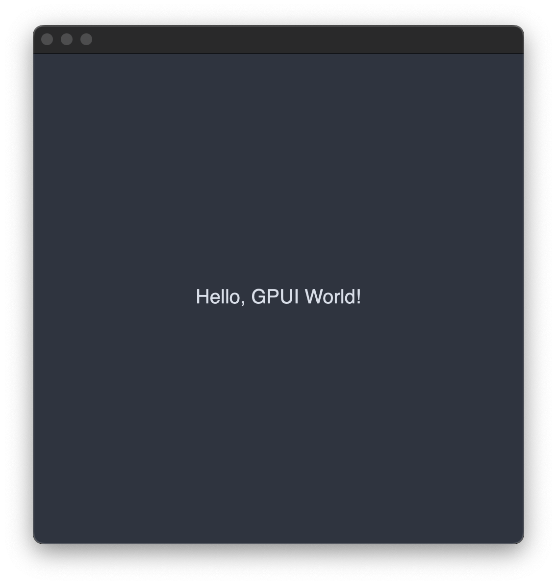

In this post, we are going to learn about GPUI - an open source UI framework developed by the Zed Industries team to build interfaces by utilizing our computer's GPU. We are going to learn the basics of GPUI by building a hello world app.

## Prerequisites
- Basic Rust
- Basic HTML, CSS and JS knowledge

## What is GPUI ?
GPUI is a **hybrid immediate and retained mode, GPU-accelerated** UI framework for Rust created by the makers of Zed editor. Before we dive into code, let me explain what these terms mean in simple language.

**GPU-accelerated** means GPUI uses our computer's graphics card to render to interface unlike traditional CPU-based rendering. This makes it extremely fast.

**Hybrid immediate and retained mode** refers to how GPUI manages the user interface:
- **Immediate mode** means the UI is redrawn from scratch every frame.
- **Retained mode** means the framework remembers the UI structure and only updates what changes, which is more efficient.
- **Hybrid** mean GPUI uses both approaches.

## Why GPUI Exists ?
Before jumping into coding, lets understand why the Zed team created GPUI? Why the existing solutions aren't good enough for them?

When Zed team decided to build their own code editor, they realized that existing UI frameworks couldn't deliver the performance they need. Hence, they decided to build their own UI framework.
The problem with traditional desktop UI frameworks is that they primarily use CPU for rendering. The CPU processes instructions sequentially. This becomes a bottleneck when you have a complex interface with many elements. Every button, text field, menu and visual element must be processed in sequence.

To fix this issue, they decided to use GPU of the computer, which can process thousands of operations in parallel. Your graphics card contains hundreads and thousands or cores that can work simultaneously. This parallel processing has been used in gaming for decades, but most desktop apps don't take advantage of it.


Now that we know why GPUI exists, lets now see how it actually works. After understanding its core concepts, we can start building our app as we will already have the understanding of its essential concepts.

## The Application Lifecycle and AppContext
When we run a GPUI app, the framework needs to take care of a lot of things that are happening simultaneously. Our app might have multiple windows open, user might be clicking buttons, typing text or resizing windows.

The `App` object is kind of the coordinator of all this activity. When we run `App::new().run()`, we are telling GPUI to "start managing the app and keep running until the user closes the app".

The `AppContext`(often shortened to `cx` in code) is what we will use to communicate with the `App` object. Every time we want to create a window, handle an event or update the display, we need to do it through the `AppContext`.

## Views and The Render Trait

In GPUI, everything we see on screen is organized into `Views`. A view is a Rust struct that represents a logical piece of our application's interface. Think of a view as a self-contained component that manages both its own data and knows how to present that data visually.

Here's what makes GPUI fundamentally different from desktop frameworks like Electron, Tauri, or traditional native frameworks: GPUI uses a declarative rendering approach rather than an imperative one. In imperative frameworks, we create interface objects once and then manually update their properties when things change. We might write code like `button.setText("New Label")` or `window.setBackgroundColor(red)` to modify existing interface elements.

GPUI works differently. It doesn't store permanent interface objects that we modify. Instead, GPUI asks our views to completely recreate their visual description every single time the screen needs to be redrawn. This happens through the `Render` trait, which every displayable struct must implement.

The `Render` trait has exactly one method: `render()`. This method takes the current state of our view and returns a fresh description of what should appear on screen. GPUI calls this method whenever it needs to redraw our view, which could be 60 times per second or more. Our job is to look at our view's current data and describe what the interface should look like based on that data.

This approach might seem inefficient at first glance, but it's actually what enables GPUI's exceptional performance. Since GPUI gets a complete description of our interface every frame, it can compare the new description with the previous one and update only the parts that actually changed. This is similar to how React's virtual DOM works, but optimized for GPU rendering instead of web browsers.

## Elements and the Component Tree

When our `render()` method runs, it creates and returns elements. Elements are temporary objects that describe visual components. They specify things like "there should be a rectangle here with this color and size" or "there should be text here with this font and content." Elements are not the actual visual components themselves, but rather instructions for creating those components.

GPUI provides built-in element types that cover most interface needs. The `div()` element creates a container that can hold other elements, similar to HTML div tags but designed for desktop applications. The `button()` element creates an interactive button that can respond to clicks. The `text()` element displays styled text content. Each element type has methods we can chain together to configure its appearance and behavior.

The power of GPUI's element system comes from composition. We build complex interfaces by nesting simple elements inside other elements. A `div()` can contain multiple child elements, and each of those children can have their own children, creating a hierarchical tree structure. This tree represents the logical structure of our interface.

When we call methods like `.child()`, `.bg()`, or `.text_xl()` on elements, we're not modifying existing objects. Instead, we're creating new element descriptions that include those properties. GPUI uses a builder pattern where each method call returns a new element with the additional configuration applied.

Now, that we understood a little bit of theory, let's start building our first simple hello world app in GPUI.

## Installing Rust Nightly for Our Project
To use GPUI we need to have the nightly version of Rust because it is using some experimental features. To install the nightly tool, run the following command:
```bash
rustup install nightly
```
This will download and install the latest nightly version of Rust.
## Setting Up Our Project
Let's start by creating a new rust project using cargo. Open the terminal and go to the directory where you want the project to be created. Now, run the following command:
```bash
cargo new gpui-hello-world
```
After running this command, you can see that you have a standard rust project that prints Hello World in console but we want to create a GPUI app and print the Hello World text in that app.

If you want to understand what each of the files mean, then please refer to this post of mine --> https://blog.0xshadow.dev/posts/markdown-parser/introduction

Now, we need to enable the nightly version of Rust specifically for this project and not for all Rust projects. To do this, create a file called `rust-toolchain.toml` in our project root directory.

```toml
[toolchain]
channel = "nightly"
```
This tells Cargo to automatically use nightly Rust whenever we work in this project directory, while keeping our global Rust installation on stable.

It's time to configure our `Cargo.toml` file to work with the nightly edition and GPUI.
## Configuring Cargo for 2024 Edition and GPUI
Let's update our `Cargo.toml` file.
```toml
[package]
name = "gpui-hello-world"
version = "0.1.0"
edition = "2024"

[dependencies]
gpui = { git = "https://github.com/zed-industries/zed" }
```
Here, we changed the `edition` from `2021` to `2024` and added the GPUI dependency.
## Writing Our Hello World Code
I'm putting the entire `main.rs` code here and after that I'll explain everything one by one.
```rust
// main.rs
use gpui::{
    div, prelude::*, px, rgb, size, App, Application, Bounds, Context, SharedString, Window,
    WindowBounds, WindowOptions,
};

struct HelloWorld {
    text: SharedString,
}

impl Render for HelloWorld {
    fn render(&mut self, _window: &mut Window, _cx: &mut Context<Self>) -> impl IntoElement {
        div()
            .flex()
            .flex_col()
            .bg(rgb(0x2e3440))
            .size(px(500.0))
            .justify_center()
            .items_center()
            .text_xl()
            .text_color(rgb(0xd8dee9))
            .child(format!("Hello, {}!", &self.text))
    }
}

fn main() {
    Application::new().run(|cx: &mut App| {
        let bounds = Bounds::centered(None, size(px(500.), px(500.)), cx);
        cx.open_window(
            WindowOptions {
                window_bounds: Some(WindowBounds::Windowed(bounds)),
                ..Default::default()
            },
            |_, cx| {
                cx.new(|_| HelloWorld {
                    text: "GPUI World".into(),
                })
            },
        )
        .unwrap();
    });
}
```
Ok, it seems a lot of code for Hello World let's unpack everything one by one.
## Imports and Dependencies
```rust
use gpui::{
    div, prelude::*, px, rgb, size, App, Application, Bounds, Context, SharedString, Window,
    WindowBounds, WindowOptions,
};
```
This import statement gets everything that we need from GPUI. Let's understand what we are importing from GPUI:
- **`App`** - The context type we receive in our main application closure for setting up windows and global app state
- **`Application`** - The main application object that manages our entire GPUI app lifecycle
- **`Bounds`** - A type that represents the position and size of windows on screen
- **`Context`** - The context object we receive in our render method, giving us access to GPUI's systems for this specific view
- **`SharedString`** - GPUI's optimized string type that allows efficient sharing of text data without unnecessary copying
- **`Window`** - Represents a window and provides access to window-specific properties and methods
- **`WindowBounds, WindowOptions`** - Configuration types for specifying how our window should be created and positioned
- **`div`** - The function that creates div elements, our main building block for layouts
- **`prelude::*`** - Brings in commonly used traits like `Render` and utility functions
- **`px, rgb, size`** - Helper functions for creating measurements (pixels), colors, and size specifications
## Defining Our View with State
```rust
struct HelloWorld {
    text: SharedString,
}
```
Our view struct contains the actual text data. The `text` field stores the text that we want to show or display in the app.

Now, you might be wondering why use `SharedString` instead of `String`?
The reason is GPUI optimizes for sharing the text between different parts of the app. The `SharedString` can be cloned very efficiently without copying the actual text data and multiple parts of our app can reference the same text without memory overhead.
## Implementing the Render Trait
```rust
impl Render for HelloWorld {
    fn render(&mut self, _window: &mut Window, _cx: &mut Context<Self>) -> impl IntoElement {
```
Now, let's understand the signature of the `render` method:
- **`&mut self`** - Mutable access to our view, allowing us to modify the view's state during rendering if needed. Even though we don't modify anything in this example, GPUI requires this flexibility.
- **`_window: &mut Window`** - Access to the window this view is being rendered in. We could use this to query window properties like current size, position, or screen DPI. The underscore indicates we're not using it in this simple example.
- **`_cx: &mut Context<Self>`** - The context object that provides access to GPUI's systems. Through this context, we could handle user input, set up timers, or create child views. The `<Self>` parameter means this context is specifically typed for our `HelloWorld` view.
### Building Our Element Tree
Now let's understand each method call in our element construction:
```rust
div()
```

This creates our root `div` element - the foundation container for everything else in our view. This is similar to how we use div for containers in HTML.

```rust
.flex()
```

This enables flexbox layout on our div. Flexbox provides powerful, automatic layout capabilities that adjust to different content sizes and window dimensions. This is why I asked you to have basic knowledge on CSS. If you don't know flexbox concept then please quickly read about it and then continue reading this tutorial.

```rust
.flex_col()
```

This sets the flex direction to column, meaning any child elements would stack vertically rather than horizontally. Even though we only have one child, this establishes the layout direction.

```rust
.bg(rgb(0x2e3440))
```

This sets the background color to a dark blue-gray. The `rgb()` function takes a hexadecimal color value and converts it to GPUI's internal color representation.

```rust
.size(px(500.0))
```

This sets both width and height to exactly 500 pixels. The `px()` function creates a pixel-based measurement. This gives us a fixed-size container regardless of window size.

```rust
.justify_center()
```

This centers content along the main axis. Since we used `.flex_col()`, the main axis runs vertically, so this centers our content vertically within the 500-pixel height.

```rust
.items_center()
```

This centers content along the cross axis. With column direction, the cross axis runs horizontally, so this centers our content horizontally within the 500-pixel width.

```rust
.text_xl()
```

This sets the text size to extra large. GPUI provides a typography scale with predefined sizes for consistent text styling across our application.

```rust
.text_color(rgb(0xd8dee9))
```

This sets the text color to light gray, providing good contrast against our dark background.

```rust
.child(format!("Hello, {}!", &self.text))
```

This adds our text content as a child element. We use `format!()` to create a dynamic string that includes our view's `text` field. The `&self.text` accesses the SharedString from our view's state.
## Application Startup and Configuration
```rust
fn main() {
    Application::new().run(|cx: &mut App| {
```
- **`Application::new()`** - Creates and initializes a new GPUI application, setting up the rendering engine, event system, and platform integration.
- **`.run(|cx: &mut App| { ... })`** - Starts the application main loop and executes our setup closure. The `cx` parameter gives us an `App` context for configuring our application's initial state.
### Understanding Closures in Rust
The `|cx: &mut App|` syntax is a **closure** in Rust, which is similar to anonymous functions or lambda functions in other languages. Let's break this down:

The `|` symbols define a closure. Think of closures as functions that we define inline without giving them a name.
#### Basic closure syntax
```rust
|parameter1, parameter2| {
    // code goes here
}
```

#### Comparing with regular functions

```rust
// Regular function:
fn my_function(cx: &mut App) {
    // setup code here
}

// Closure (what we're actually doing):
|cx: &mut App| {
    // setup code here
}
```
The closure is like defining and using the function all in one place.
**Why use a closure here?**

GPUI's `run` method needs to:

1. Initialize all the graphics systems
2. Set up the main application loop
3. Let us configure our initial windows and views
4. Start processing events and rendering
The `run` method says: "I'll handle all the complex setup, but when I'm ready, I'll call your closure so you can tell me what windows and views you want."

**What is `cx: &mut App`?**

- `cx` is just a variable name (short for "context")
- `&mut App` means "a mutable reference to an App object"
- The `App` object gives us access to GPUI's application-level features like creating windows

Think of `cx` as a control panel that GPUI hands us, saying "here, use this to set up your application."

## Window Creation and Positioning
```rust
let bounds = Bounds::centered(None, size(px(500.), px(500.)), cx);
```
This calculates where our window should appear:
- `Bounds::centered()` creates window bounds that center the window on screen
- `None` means use the primary monitor (we could specify a particular monitor)
- `size(px(500.), px(500.))` creates a 500x500 pixel size specification
- `cx` provides information about the current screen configuration

```rust
cx.open_window(
    WindowOptions {
        window_bounds: Some(WindowBounds::Windowed(bounds)),
        ..Default::default()
    },
```

Creates a window with specific options:
- `WindowOptions { ... }` configures window properties
- `window_bounds: Some(WindowBounds::Windowed(bounds))` sets the window to normal windowed mode with our calculated position and size
- `..Default::default()` uses default values for other options like window title, decorations, etc.
## View Creation and Initialization
```rust
|_, cx| {
    cx.new(|_| HelloWorld {
        text: "GPUI World".into(),
    })
},
```

We actually have **three closures** nested in our code:
1. **Main setup closure:** `|cx: &mut App| { ... }` - Sets up our application
2. **Window content closure:** `|_, cx| { ... }` - Defines what goes in the window
3. **View creation closure:** `|_| HelloWorld { ... }` - Creates our view instance

Each closure handles a different level of setup:
1. **Application level** - "What windows should exist?"
2. **Window level** - "What should go in this specific window?"
3. **View level** - "How should this view be initialized?"

The window creation closure does two things:
- Takes a window handle (ignored with `_`) and a window-specific context
- Uses `cx.new()` to create and register our view with GPUI
- The inner closure creates our initial `HelloWorld` instance with "GPUI World" as the text
- `.into()` converts the string literal into a `SharedString`
### The `_` Parameter
You'll notice some closures use `_` as a parameter name:
```rust
|_, cx| { ... }
|_| HelloWorld { ... }
```
The `_` means "I receive a parameter here, but I don't need to use it." It's Rust's way of saying "ignore this parameter" without getting compiler warnings.

## The Complete Execution Flow
When we run this application:

1. `Application::new()` initializes all GPUI systems
2. `.run()` starts the main application loop and calls our setup closure
3. We calculate window bounds for a centered 500x500 window
4. We create a window with those specifications
5. We create a `HelloWorld` view instance with initial text
6. GPUI calls our view's `render()` method to get the element description
7. Our `render()` method returns a 500x500 div with centered text
8. GPUI renders this using the GPU and displays our window
9. The application loop continues, ready for user interaction or updates

## Building and Running Our Application

Now let's see our hello world app in action. In your terminal, make sure you're in the project directory and run:

```bash
cargo run
```

The first time you run this command, it will take several minutes to complete. Cargo needs to download the Zed repository, compile GPUI and all its dependencies, and then compile our application. We'll see a lot of output as Cargo builds everything.

Don't worry if this seems slow - this lengthy compilation only happens the first time. Subsequent runs will be much faster because Cargo caches the compiled dependencies.

When the compilation finishes and our application starts, we should see a 500x500 pixel window appear with our "Hello, GPUI World!" message centered on a dark background. The text should be large and clearly visible in light gray against the dark blue-gray background. Something like this:


Try interacting with the window - we can move it around, resize it, minimize it, and close it. Even though we haven't written any code to handle these interactions, GPUI provides them automatically because they're standard window operations.

## Conclusion
This concludes learning the basics of GPUI and displaying hello world in the screen. I hope you've learned something from this post and in the next post we are going to learn about handling user inputs, managing state changes, making our app respond to user actions and understanding event handling in GPUI. Learning these things before implementing the todo app would help us cover a lot of concepts in an isolated way making them simpler to understand. See you soon.
