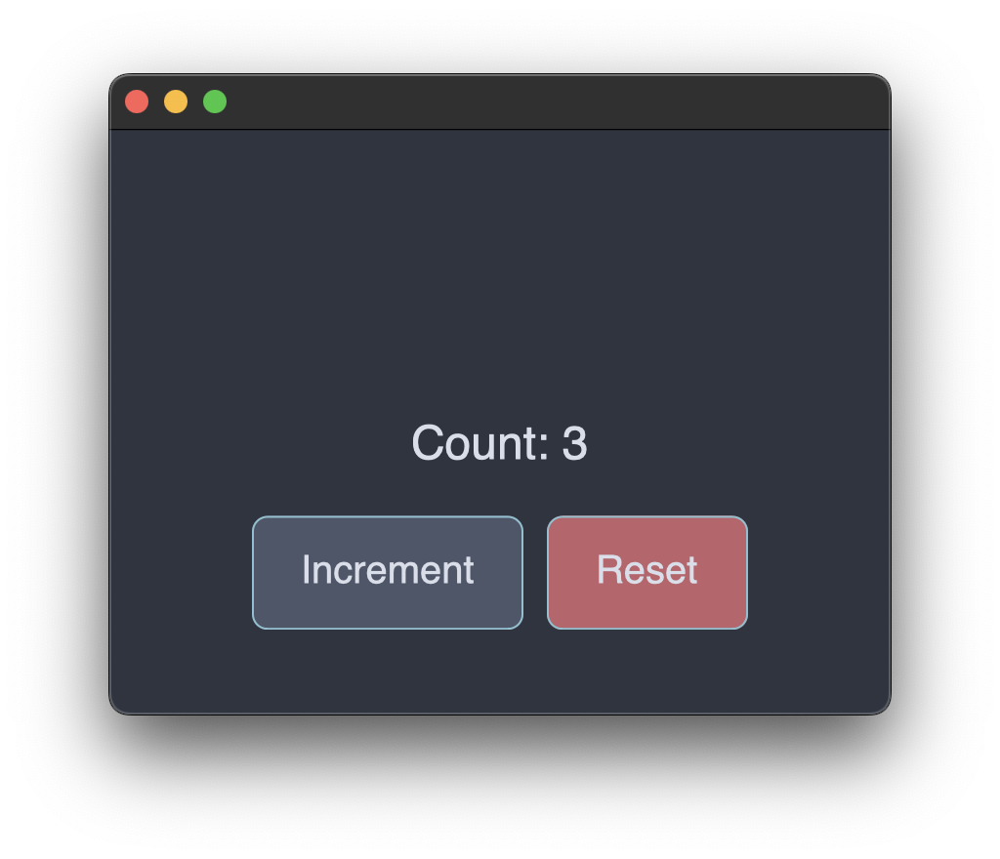

Alright, so in this post we are going to learn about interaction. We are going to learn how to handle user input, manage state changes, and create dynamic interfaces that respond to user actions. This is where the interesting part begins, trust me. In this post, we are going to build a simple counter app to understand how to handle interaction in GPUI. Lets go

## Pre-requisites
- Rust basics
- Hello world post on this series ([Click here](https://blog.0xshadow.dev/posts/learning-gpui/gpui-hello-world-tutorial/))

## Understanding GPUI's Event System
Ok, before writing any code, lets first understand how GPUI handles user interaction. When we click a button or press a key, GPUI captures these events and routes them to the appropriate views (view is a struct that holds the attributes and methods). The important thing to note is that, when we click on a button, GPUI determines which view should handle that click based on the element tree structure.

Now, for keyboard events, GPUI uses something called a **focus system**. Let's understand that in depth as it took me sometime to understand.
## Understanding Focus
Ok, so the focus concept might be a bit confusing at first. Let me explain it step by step, because it's actually pretty important to understand.

**What is Focus?**
Focus refers to which element on screen can currently receive keyboard input.

Real-world examples:
- When you click in a text field, it gets focus and you can type in it
- When you press Tab to navigate through a form, focus moves from field to field
- When you're playing a game, the game window needs focus to receive your key presses

**Why Does GPUI Need a Focus System?**
Without focus, GPUI wouldn't know:
- Which element should receive keyboard shortcuts (Space bar, R key, etc.)
- Which element should respond when you press Tab
- Which element is currently "active" for accessibility tools
- How to properly manage keyboard navigation between elements

So basically, the focus system makes sure keyboard input goes to the right place.

**Breaking Down the GPUI Focus Implementation**
Let's look at each piece:

**1. The Focus Handle**


```rust
struct Counter {
    count: i32,
    focus_handle: FocusHandle,
}
```

The `FocusHandle` is basically a unique identifier that GPUI uses to track which element currently has focus. Think of it as a token that says "I can receive keyboard input."

**2. Creating the Focus Handle**

```rust
fn new(cx: &mut Context<Self>) -> Self {
    Self {
        count: 0,
        focus_handle: cx.focus_handle(), // Register with GPUI's focus system
    }
}
```

`cx.focus_handle()` tells GPUI to create a new focus handle for this Counter

**3. The Focusable Trait**

```rust
impl Focusable for Counter {
    fn focus_handle(&self, _: &App) -> FocusHandle {
        self.focus_handle.clone()  // Give GPUI our focus handle when asked
    }
}
```

This trait is like saying "Yes, this Counter can receive focus." GPUI calls this method to get the focus handle when it needs to manage focus.

**4. Connecting Focus to the UI**

```rust
div()
    .track_focus(&self.focus_handle(cx))  // Tell this div to use our focus handle
    .on_action(cx.listener(Self::increment))  // These only work when we have focus!
    .on_action(cx.listener(Self::reset))
```

`track_focus()` connects the visual element (the div) to our focus system. Now when this div has focus:
- Keyboard shortcuts work (Space bar → increment, R → reset)
- The element can show visual focus indicators
- Screen readers know this element is active

**5. Keyboard Bindings**

```rust
cx.bind_keys([
    gpui::KeyBinding::new("space", Increment, None),  // Space bar → Increment action
    gpui::KeyBinding::new("r", Reset, None),          // R key → Reset action
]);
```

These keyboard shortcuts **only work when your Counter has focus**. If another element has focus, these keys won't trigger your actions.
**The Complete Focus Chain**

For keyboard shortcuts to work in GPUI, you need this complete chain (and trust me, you need all of these):
1. **Focus Handle Creation**: `cx.focus_handle()` in constructor
2. **Focusable Implementation**: Implement the `Focusable` trait
3. **UI Connection**: Use `track_focus()` to connect visual elements
4. **Action Registration**: Register actions with `on_action()`
5. **Key Bindings**: Bind keys to actions in the application setup

Miss any of these steps, and your keyboard shortcuts won't work. Ask me how I know!
## Creating an Interactive App
Alright, so instead of creating a new project, lets modify our hello world `main.rs` code to build this app. In this app, there will be a simple counter that increments when we click a button, and a reset button to reset the count to 0, that's it. You might extend it for practice to add a decrement button too.

Again, I'll give you the entire code here and then explain block by block:

```rust
// Correct GPUI interactive counter based on the official input.rs example
use gpui::{
    App, Application, Bounds, Context, FocusHandle, Focusable, MouseButton, MouseUpEvent, Window,
    WindowBounds, WindowOptions, actions, div, prelude::*, px, rgb, size,
};

// Define actions using the correct GPUI pattern
actions!(counter, [Increment, Reset]);

struct Counter {
    count: i32,
    focus_handle: FocusHandle,
}

impl Counter {
    fn new(cx: &mut Context<Self>) -> Self {
        Self {
            count: 0,
            focus_handle: cx.focus_handle(),
        }
    }

    // Action handlers - these get called when actions are triggered
    fn increment(&mut self, _: &Increment, _: &mut Window, cx: &mut Context<Self>) {
        self.count += 1;
        cx.notify();
    }

    fn reset(&mut self, _: &Reset, _: &mut Window, cx: &mut Context<Self>) {
        self.count = 0;
        cx.notify();
    }

    // Mouse event handlers - these follow the GPUI pattern from input.rs
    fn on_increment_click(&mut self, _: &MouseUpEvent, _: &mut Window, cx: &mut Context<Self>) {
        self.count += 1;
        cx.notify();
    }

    fn on_reset_click(&mut self, _: &MouseUpEvent, _: &mut Window, cx: &mut Context<Self>) {
        self.count = 0;
        cx.notify();
    }
}

impl Focusable for Counter {
    fn focus_handle(&self, _: &App) -> FocusHandle {
        self.focus_handle.clone()
    }
}

impl Render for Counter {
    fn render(&mut self, _window: &mut Window, cx: &mut Context<Self>) -> impl IntoElement {
        div()
            .flex()
            .flex_col()
            .gap_4()
            .bg(rgb(0x2e3440))
            .size(px(400.0))
            .justify_center()
            .items_center()
            .text_xl()
            .text_color(rgb(0xd8dee9))
            .track_focus(&self.focus_handle(cx))
            // Action-based event handling (keyboard shortcuts)
            .on_action(cx.listener(Self::increment))
            .on_action(cx.listener(Self::reset))
            .child(
                // Display the current count
                div().text_2xl().child(format!("Count: {}", self.count)),
            )
            .child(
                div()
                    .flex()
                    .flex_row()
                    .gap_3()
                    .child(
                        // Increment button using mouse event handler
                        div()
                            .bg(rgb(0x4c566a))
                            .hover(|style| style.bg(rgb(0x5e81ac)).cursor_pointer())
                            .border_1()
                            .border_color(rgb(0x88c0d0))
                            .rounded_lg()
                            .px_6()
                            .py_3()
                            .child("Increment")
                            .on_mouse_up(MouseButton::Left, cx.listener(Self::on_increment_click)),
                    )
                    .child(
                        // Reset button
                        div()
                            .bg(rgb(0xbf616a))
                            .hover(|style| style.bg(rgb(0xd08770)).cursor_pointer())
                            .border_1()
                            .border_color(rgb(0x88c0d0))
                            .rounded_lg()
                            .px_6()
                            .py_3()
                            .child("Reset")
                            .on_mouse_up(MouseButton::Left, cx.listener(Self::on_reset_click)),
                    ),
            )
    }
}

fn main() {
    Application::new().run(|cx: &mut App| {
        let bounds = Bounds::centered(None, size(px(400.), px(300.)), cx);

        // Bind keyboard shortcuts to actions (following the input.rs pattern)
        cx.bind_keys([
            gpui::KeyBinding::new("space", Increment, None),
            gpui::KeyBinding::new("r", Reset, None),
        ]);

        cx.open_window(
            WindowOptions {
                window_bounds: Some(WindowBounds::Windowed(bounds)),
                ..Default::default()
            },
            |_, cx| cx.new(|cx| Counter::new(cx)),
        )
        .unwrap();
    });
}
```

### Imports and Dependencies

So first, let's look at the imports:

```rust
use gpui::{
    actions, div, prelude::*, px, rgb, size, App, Application, Bounds, Context, FocusHandle,
    Focusable, MouseButton, MouseUpEvent, Window, WindowBounds, WindowOptions,
};
```

All of the new imports that you are seeing is for working with mouse events and focus management:

- **actions** - Macro for defining semantic user actions
- **FocusHandle, Focusable** - Enable keyboard interaction and focus management
- **MouseButton, MouseUpEvent** - Specific mouse event types for precise interaction handling
- **Standard GPUI components** - Core framework elements for building interfaces

So basically, we're adding support for both mouse and keyboard interactions here.

### Action Definition
Now, let's look at how we define actions:

```rust
// Define actions using the correct GPUI pattern
actions!(counter, [Increment, Reset]);
```

We are using a `actions!` macro for the 2 functionalities in the `counter` namespace. You can use whatever `namespace` you want but its good to keep the namespace name meaningful. In this case, we are concerned with the counter, so we are keeping these 2 functionalities in the `counter` namespace.

This `actions!` macro represents user's intention rather than raw input events. These actions can be triggered by:

- Keyboard shortcuts (defined in main())
- Mouse events (through action handlers)

The action system provides semantic meaning - instead of handling "key pressed" or "mouse clicked," we handle "user wants to increment" or "user wants to reset." Pretty neat, right?

### View Structure with State

```rust
struct Counter {
    count: i32,
    focus_handle: FocusHandle,
}
```

This is our `Counter` view that'll have our `count` state and `focus_handle` required for keyboard interaction that connects this view to GPUI's focus management system.

The `focus_handle` is crucial because it:
- Serves as a unique identifier for this view in GPUI's focus system
- Enables keyboard shortcut reception
- Provides accessibility features
- Enables proper tab navigation
- Allows visual focus indicators

### Constructor and State Management

```rust
impl Counter {
    fn new(cx: &mut Context<Self>) -> Self {
        Self {
            count: 0,
            focus_handle: cx.focus_handle(),
        }
    }
```

The constructor receives a context and uses it to create a focus handle. The `cx.focus_handle()` call registers this view with GPUI's focus system.

### Action Handlers

```rust
fn increment(&mut self, _: &Increment, _: &mut Window, cx: &mut Context<Self>) {
    self.count += 1;
    cx.notify();
}

fn reset(&mut self, _: &Reset, _: &mut Window, cx: &mut Context<Self>) {
    self.count = 0;
    cx.notify();
}
```

These two action handlers are used for increment and reseting the count.
Action handlers follow a specific signature:

- `&mut self` - Mutable access to modify view state
- `_: &ActionType` - The specific action (unused in simple cases)
- `_: &mut Window` - Window reference for advanced operations
- `cx: &mut Context<Self>` - View context for framework operations

`cx.notify()` is essential - it informs GPUI that state has changed and triggers a re-render on the next frame.

**Important**: These action handlers only execute when the view has focus and the corresponding keyboard shortcuts are pressed. So if your view doesn't have focus, pressing Space won't do anything.

### Direct Mouse Event Handlers

```rust
fn on_increment_click(&mut self, _: &MouseUpEvent, _: &mut Window, cx: &mut Context<Self>) {
    self.count += 1;
    cx.notify();
}

fn on_reset_click(&mut self, _: &MouseUpEvent, _: &mut Window, cx: &mut Context<Self>) {
    self.count = 0;
    cx.notify();
}
```

These handlers provide direct mouse interaction. The signature matches the action handlers but receives `MouseUpEvent` instead of action types. Using mouse up events prevents accidental triggers when users press the mouse button on an element but release elsewhere.

Unlike action handlers, mouse event handlers work regardless of focus state - they respond to direct mouse interaction on the specific element. So you can always click the buttons, even if the view doesn't have focus.

### Focus System Integration

```rust
impl Focusable for Counter {
    fn focus_handle(&self, _: &App) -> FocusHandle {
        self.focus_handle.clone()
    }
}
```

This trait implementation connects our view to GPUI's focus management. The framework uses this to determine which view should receive keyboard events and manage focus transitions.

For keyboard shortcuts to work in GPUI, you need this complete chain:

1. **Focus Handle Creation**: `cx.focus_handle()` in constructor
2. **Focusable Implementation**: Implement the `Focusable` trait
3. **UI Connection**: Use `track_focus()` to connect visual elements
4. **Action Registration**: Register actions with `on_action()`
5. **Key Bindings**: Bind keys to actions in the application setup

Miss any of these steps, and your keyboard shortcuts won't work.
### Interface Rendering
Let's start with setting up the container:

```rust
impl Render for Counter {
    fn render(&mut self, _window: &mut Window, cx: &mut Context<Self>) -> impl IntoElement {
        div()
            .flex()
            .flex_col()
            .gap_4()
            .bg(rgb(0x2e3440))
            .size(px(400.0))
            .justify_center()
            .items_center()
            .text_xl()
            .text_color(rgb(0xd8dee9))
```

If you have followed the hello world post, then the above code is already known to you.

Now, lets integrate the events:

```rust
.track_focus(&self.focus_handle(cx))
.on_action(cx.listener(Self::increment))
.on_action(cx.listener(Self::reset))
```

This is where the focus system connects to the UI:

- `track_focus` - Connects this element to the focus system for keyboard interaction (super important!)
- `on_action` - Registers action handlers that can be triggered by keyboard shortcuts
- `cx.listener` - Creates listeners that can call methods on our view instance

Now, lets add the display elements:

```rust
.child(
    div().text_2xl().child(format!("Count: {}", self.count)),
)
```

Creates the display area showing current count. Each render cycle generates fresh text based on current state, demonstrating GPUI's declarative approach where we describe what should appear rather than imperatively updating display elements.

Now, lets add the interactive buttons:

```rust
.child(
    div()
        .bg(rgb(0x4c566a))
        .hover(|style| style.bg(rgb(0x5e81ac)).cursor_pointer())
        .border_1()
        .border_color(rgb(0x88c0d0))
        .rounded_lg()
        .px_6()
        .py_3()
        .child("Increment")
        .on_mouse_up(MouseButton::Left, cx.listener(Self::on_increment_click))
)
```

Notice how the button uses `.on_mouse_up()` rather than `.on_action()`. This creates direct mouse interaction that works regardless of focus state.

Its time to start the Application configuration:

```rust
fn main() {
    Application::new().run(|cx: &mut App| {
        let bounds = Bounds::centered(None, size(px(400.), px(300.)), cx);

        cx.bind_keys([
            gpui::KeyBinding::new("space", Increment, None),
            gpui::KeyBinding::new("r", Reset, None),
        ]);
```

The `cx.bind_keys()` call creates global keyboard shortcuts. These shortcuts trigger the `Increment` and `Reset` actions, but only when a focused element has registered handlers for these actions via `on_action()`.

Finally, lets create the Window and View:

```rust
cx.open_window(
    WindowOptions {
        window_bounds: Some(WindowBounds::Windowed(bounds)),
        ..Default::default()
    },
    |_, cx| {
        cx.new(|cx| Counter::new(cx))
    },
)
.unwrap();
```

This creates the window and initializes our Counter view. When the window opens, the Counter automatically receives focus, making the keyboard shortcuts immediately available.

This is our app:
For keyboard interaction:
- Hit `space` to increment
- Hit `r` to reset


## How It All Works Together

So when you run the counter app, here's what happens:

1. **Application Starts**: The Counter view is created with a focus handle
2. **Window Opens**: The Counter automatically receives focus
3. **Focus Connection**: `track_focus()` connects the UI element to the focus system
4. **Keyboard Input**: Space bar and R key work because the Counter has focus and everything is connected properly
5. **Mouse Input**: Button clicks work immediately through direct event handlers
6. **State Updates**: Both interaction methods trigger state changes and UI re-renders


## Conclusion
So, we understood basic interactivity concepts including focus. I feel like this interactivity knowledge is very important for our next article where we will build a todo app. I'm really excited about it. See you soon.
