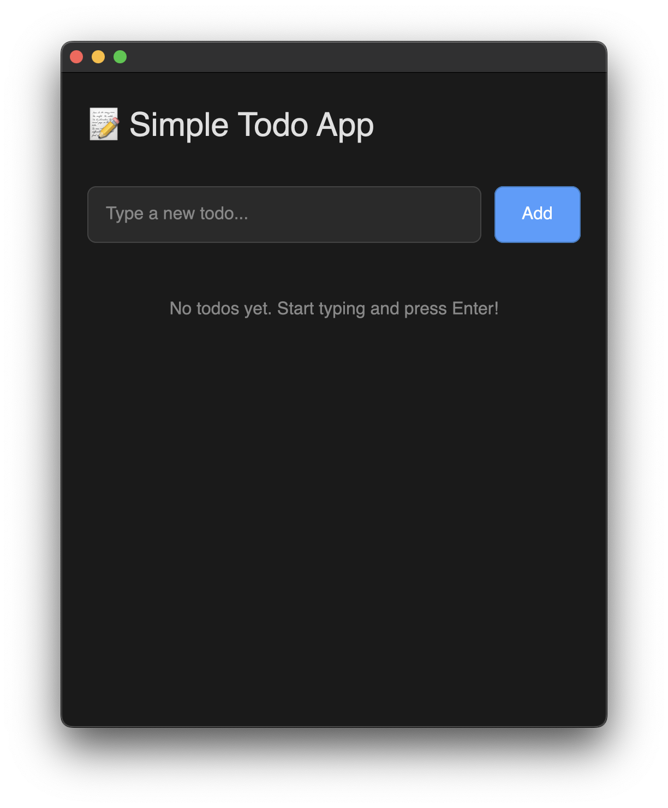

# Building a Todo App with GPUI

So, in this post, we're going to build a simple todo app using GPUI. Now, we'll use whatever we've learned till now and also learn some new things along the way. Alright, let's begin!

## Prerequisites

- Rust basics
- Previous 2 articles on this GPUI series

## Setting up the Project

Ok, I'm not going to set up a new project again, but if you want to, then please follow the first article in this series to learn how to setup a project.

Now, I'm going to put the entire code here and then we'll go through each part in detail.

```rust
use gpui::{
    App, Application, Bounds, Context, FocusHandle, Focusable, KeyDownEvent, MouseButton,
    MouseUpEvent, Window, WindowBounds, WindowOptions, actions, div, prelude::*, px, rgb, size,
};

actions!(todo, [AddTodo, Backspace, ClearInput]);

#[derive(Clone, Debug)]
struct Todo {
    id: usize,
    text: String,
}

impl Todo {
    fn new(id: usize, text: String) -> Self {
        Self { id, text }
    }
}

struct TodoApp {
    todos: Vec<Todo>,
    input_text: String,
    next_id: usize,
    focus_handle: FocusHandle,
}

impl TodoApp {
    fn new(cx: &mut Context<Self>) -> Self {
        Self {
            todos: Vec::new(),
            input_text: String::new(),
            next_id: 1,
            focus_handle: cx.focus_handle(),
        }
    }

    fn add_todo(&mut self, _: &AddTodo, _: &mut Window, cx: &mut Context<Self>) {
        if !self.input_text.trim().is_empty() {
            let todo = Todo::new(self.next_id, self.input_text.trim().to_string());
            self.todos.push(todo);
            self.next_id += 1;
            self.input_text.clear();
            cx.notify();
        }
    }

    fn backspace(&mut self, _: &Backspace, _: &mut Window, cx: &mut Context<Self>) {
        if !self.input_text.is_empty() {
            self.input_text.pop();
            cx.notify();
        }
    }

    fn clear_input(&mut self, _: &ClearInput, _: &mut Window, cx: &mut Context<Self>) {
        self.input_text.clear();
        cx.notify();
    }

    fn on_add_click(&mut self, _: &MouseUpEvent, _: &mut Window, cx: &mut Context<Self>) {
        if !self.input_text.trim().is_empty() {
            let todo = Todo::new(self.next_id, self.input_text.trim().to_string());
            self.todos.push(todo);
            self.next_id += 1;
            self.input_text.clear();
            cx.notify();
        }
    }

    fn delete_todo(&mut self, todo_id: usize, cx: &mut Context<Self>) {
        self.todos.retain(|todo| todo.id != todo_id);
        cx.notify();
    }
}

impl Focusable for TodoApp {
    fn focus_handle(&self, _: &App) -> FocusHandle {
        self.focus_handle.clone()
    }
}

impl Render for TodoApp {
    fn render(&mut self, _window: &mut Window, cx: &mut Context<Self>) -> impl IntoElement {
        div()
            .flex()
            .flex_col()
            .gap_4()
            .bg(rgb(0x1a1a1a))
            .size_full()
            .p_6()
            .track_focus(&self.focus_handle(cx))
            .on_action(cx.listener(Self::add_todo))
            .on_action(cx.listener(Self::backspace))
            .on_action(cx.listener(Self::clear_input))
            // Handle regular character input
            .on_key_down(cx.listener(|this, event: &KeyDownEvent, _, cx| {
                if let Some(key_char) = &event.keystroke.key_char {
                    if key_char.len() == 1 && !event.keystroke.modifiers.control {
                        this.input_text.push_str(key_char);
                        cx.notify();
                    }
                }
            }))
            .child(
                div()
                    .text_3xl()
                    .text_color(rgb(0xe0e0e0))
                    .mb_4()
                    .child("📝 Simple Todo App"),
            )
            .child(
                div()
                    .flex()
                    .flex_row()
                    .gap_3()
                    .child(
                        div()
                            .flex()
                            .flex_1()
                            .bg(rgb(0x2a2a2a))
                            .border_1()
                            .border_color(rgb(0x444444))
                            .rounded_lg()
                            .px_4()
                            .py_3()
                            .text_color(rgb(0xe0e0e0))
                            .child(if self.input_text.is_empty() {
                                div().text_color(rgb(0x888888)).child("Type a new todo...")
                            } else {
                                div().child(self.input_text.clone())
                            })
                    )
                    .child(
                        div()
                            .bg(rgb(0x4a9eff))
                            .hover(|style| style.bg(rgb(0x357abd)).cursor_pointer())
                            .border_1()
                            .border_color(rgb(0x357abd))
                            .rounded_lg()
                            .px_6()
                            .py_3()
                            .text_color(rgb(0xffffff))
                            .child("Add")
                            .on_mouse_up(MouseButton::Left, cx.listener(Self::on_add_click)),
                    ),
            )
            .child(
                div()
                    .flex()
                    .flex_col()
                    .gap_2()
                    .children(self.todos.iter().map(|todo| {
                        let todo_id = todo.id;

                        div()
                            .flex()
                            .flex_row()
                            .items_center()
                            .justify_between()
                            .bg(rgb(0x2a2a2a))
                            .border_1()
                            .border_color(rgb(0x444444))
                            .rounded_lg()
                            .p_4()
                            .hover(|style| style.bg(rgb(0x333333)))
                            .child(
                                div()
                                    .flex_1()
                                    .text_color(rgb(0xe0e0e0))
                                    .child(todo.text.clone()),
                            )
                            .child(
                                div()
                                    .bg(rgb(0x7c4a4a))
                                    .hover(|style| style.bg(rgb(0x9c5a5a)).cursor_pointer())
                                    .border_1()
                                    .border_color(rgb(0x944444))
                                    .rounded_lg()
                                    .px_3()
                                    .py_2()
                                    .text_color(rgb(0xffffff))
                                    .text_xs()
                                    .child("Delete")
                                    .on_mouse_up(MouseButton::Left, cx.listener(move |this, _e, _w, cx| {
                                        this.delete_todo(todo_id, cx);
                                    })),
                            )
                    }))
                    .when(self.todos.is_empty(), |container| {
                        container.child(
                            div()
                                .text_center()
                                .text_color(rgb(0x888888))
                                .py_8()
                                .child("No todos yet. Start typing and press Enter!"),
                        )
                    }),
            )
    }
}

fn main() {
    Application::new().run(|cx: &mut App| {
        let bounds = Bounds::centered(None, size(px(500.), px(600.)), cx);

        cx.bind_keys([
            gpui::KeyBinding::new("enter", AddTodo, None),
            gpui::KeyBinding::new("backspace", Backspace, None),
            gpui::KeyBinding::new("escape", ClearInput, None),
        ]);

        let window = cx
            .open_window(
                WindowOptions {
                    window_bounds: Some(WindowBounds::Windowed(bounds)),
                    ..Default::default()
                },
                |_, cx| cx.new(|cx| TodoApp::new(cx)),
            )
            .unwrap();

        window
            .update(cx, |view, window, cx| {
                window.focus(&view.focus_handle(cx));
                cx.activate(true);
            })
            .unwrap();
    });
}
```

## Imports and Data Structures

Ok, let's start by looking at our imports:

```rust
use gpui::{
    App, Application, Bounds, Context, FocusHandle, Focusable, KeyDownEvent, MouseButton,
    MouseUpEvent, Window, WindowBounds, WindowOptions, actions, div, prelude::*, px, rgb, size,
};
```

So, we've added a new import `KeyDownEvent` to handle keyboard input. We're doing this so we can capture what the user is typing in the input box

Now, let's look at our Todo struct:

```rust
#[derive(Clone, Debug)]
struct Todo {
    id: usize,
    text: String,
}
```

This is our `Todo` struct. It's a simple struct that holds a unique ID and the todo text for each todo item. The `#[derive(Clone, Debug)]` lets us clone todos and print them for debugging

```rust
impl Todo {
    fn new(id: usize, text: String) -> Self {
        Self { id, text }
    }
}
```

And this is just a simple constructor function to create a new Todo. Nothing fancy here - it takes an ID and text, and returns a new Todo instance.

## Actions

```rust
actions!(todo, [AddTodo, Backspace, ClearInput]);
```

Ok so, in our Counter app we used the namespace `counter` and 2 actions, but in this todo app we're using the namespace `todo` with three actions. The `AddTodo` action creates a new todo when the user presses Enter, `Backspace` handles deleting characters while typing, and `ClearInput` clears the entire input field when pressing Escape.

## App State

Now, let's look at our main app struct:

```rust
struct TodoApp {
    todos: Vec<Todo>,          // List of all todos
    input_text: String,        // What the user is currently typing
    next_id: usize,           // Counter to give each todo a unique ID
    focus_handle: FocusHandle, // Needed for keyboard input
}
```

So this is our `TodoApp` view. This is definitely more complex than our counter app which only had `count: i32` and `focus_handle`. The `todos` field is a collection of todos stored in a vector, with each element being a `Todo` struct. The `input_text` field stores the current text input from the user. The `next_id` field ensures each todo gets a unique identifier. Finally, the `focus_handle` allows us to receive keyboard events.

## Constructor

```rust
impl TodoApp {
    fn new(cx: &mut Context<Self>) -> Self {
        Self {
            todos: Vec::new(),
            input_text: String::new(),
            next_id: 1,
            focus_handle: cx.focus_handle(),
        }
    }
}
```

Alright, so this constructor creates a new TodoApp instance. We start with an empty vector for todos, an empty string for input text, ID starting at 1 for the first todo, and a focus handle from the context to receive keyboard events.

## Action Handlers - The Core Logic

Now let's dive into each action handler and understand how they work:

### Adding Todos

```rust
fn add_todo(&mut self, _: &AddTodo, _: &mut Window, cx: &mut Context<Self>) {
    if !self.input_text.trim().is_empty() {
        let todo = Todo::new(self.next_id, self.input_text.trim().to_string());
        self.todos.push(todo);
        self.next_id += 1;
        self.input_text.clear();
        cx.notify();
    }
}
```

Ok so, this action handler follows the same signature pattern as our counter's increment method but does more sophisticated work:

- First, it checks if the input field contains actual content using `!self.input_text.trim().is_empty()`. The `trim()` removes whitespace, so empty or whitespace only input is ignored
- Then it creates a new todo with the current ID and the trimmed input text using our `Todo::new()` constructor.
- **State Updates**:
    - Adds the new todo to our vector with `self.todos.push(todo)`
    - Increments `next_id` for the next todo to ensure uniqueness
    - Clears the input field with `self.input_text.clear()`
- Finally, we're calling `cx.notify()` to trigger a re-render with the new state.

### Handling Backspace

```rust
fn backspace(&mut self, _: &Backspace, _: &mut Window, cx: &mut Context<Self>) {
    if !self.input_text.is_empty() {
        self.input_text.pop();
        cx.notify();
    }
}
```

So this action handler manages character deletion:

1. Verifies there's text to delete with `!self.input_text.is_empty()`
2. Uses `pop()` to remove the last character from the string
3. Calls `cx.notify()` to re-render with the updated input field


### Clearing Input

```rust
fn clear_input(&mut self, _: &ClearInput, _: &mut Window, cx: &mut Context<Self>) {
    self.input_text.clear();
    cx.notify();
}
```

And this is the simplest action handler:

1. Uses `clear()` to empty the entire input field instantly
2. Notifies GPUI to re-render

## Mouse Event Handlers

Now, while actions handle keyboard events, we also need mouse event handlers for clicking buttons:

### Add Button Click Handler

```rust
fn on_add_click(&mut self, _: &MouseUpEvent, _: &mut Window, cx: &mut Context<Self>) {
    if !self.input_text.trim().is_empty() {
        let todo = Todo::new(self.next_id, self.input_text.trim().to_string());
        self.todos.push(todo);
        self.next_id += 1;
        self.input_text.clear();
        cx.notify();
    }
}
```

Ok, notice this is **exactly the same logic** as our `add_todo` action handler! This is intentional - it provides two ways to add a todo:

- Keyboard users can press Enter
- Mouse users can click the Add button

Both methods should behave identically, so we duplicate the logic. In a larger application, you might extract this into a separate private method to avoid duplication, but for now this works fine.

### Delete Todo Handler

```rust
fn delete_todo(&mut self, todo_id: usize, cx: &mut Context<Self>) {
    self.todos.retain(|todo| todo.id != todo_id);
    cx.notify();
}
```

So this method removes a specific todo by its ID:

1. The `retain` method keeps only todos that don't match the given ID. It's equivalent to filtering out the todo we want to delete.
2. The matching todo is removed from the vector automatically.
3. Notifies GPUI to re-render without the deleted todo.

This method takes a `todo_id` parameter because it's called from individual delete button click handlers, each knowing which specific todo to remove.

## Focus System Integration

```rust
impl Focusable for TodoApp {
    fn focus_handle(&self, _: &App) -> FocusHandle {
        self.focus_handle.clone()
    }
}
```

Alright, so this trait implementation is identical to our counter app. It connects our TodoApp to GPUI's focus management system, allowing keyboard event reception. Without this, our action handlers would never be triggered

## Text Input - The Tricky Part

Now, handling text input in GPUI requires understanding two different input mechanisms:

### Special Keys (Through Actions)

```rust
.on_action(cx.listener(Self::add_todo))
.on_action(cx.listener(Self::backspace))
.on_action(cx.listener(Self::clear_input))
```

So for special keys like Enter, Backspace, and Escape, we use GPUI's action system because it's more reliable across different platforms, provides semantic meaning to our actions, makes it easier to rebind keys later if needed, and integrates with GPUI's command palette system. Smart design!

### Regular Character Input (Through Raw Events)

```rust
.on_key_down(cx.listener(|this, event: &KeyDownEvent, _, cx| {
    if let Some(key_char) = &event.keystroke.key_char {
        if key_char.len() == 1 && !event.keystroke.modifiers.control {
            this.input_text.push_str(key_char);
            cx.notify();
        }
    }
}))
```

Now for regular typing (a, b, c, 1, 2, 3, space, etc.), we use raw key events. Let's break down this complex closure:

1. `event.keystroke.key_char` contains the character representation of the pressed key, if any.
2. `key_char.len() == 1` ensures we only accept single characters, filtering out special keys like "Shift" or "Control" which have longer names.
3. `!event.keystroke.modifiers.control` ignores keys pressed with Ctrl, preventing interference with system shortcuts like Ctrl+C.
4. `this.input_text.push_str(key_char)` adds the typed character to our input text.
5. `cx.notify()` triggers a re-render to show the new character.

## Interface Rendering

Ok, so the render method builds our entire user interface. Let's understand each section:

### Main Container Setup

```rust
impl Render for TodoApp {
    fn render(&mut self, _window: &mut Window, cx: &mut Context<Self>) -> impl IntoElement {
        div()
            .flex()
            .flex_col()
            .gap_4()
            .bg(rgb(0x1a1a1a))
            .size_full()
            .p_6()
            .track_focus(&self.focus_handle(cx))
```

So this creates our main container with flexbox column layout and 4px gaps between children, a dark background color (#1a1a1a) for a modern look, full window size with 6px padding on all sides, and focus tracking that's important for receiving keyboard input.

### Header Section

```rust
.child(
    div()
        .text_3xl()
        .text_color(rgb(0xe0e0e0))
        .mb_4()
        .child("📝 Simple Todo App"),
)
```

Just a simple header with large text size (text_3xl), light text color for contrast against dark background, bottom margin for spacing, and emoji for visual appeal. Nothing fancy, but it looks good!

### Input Section - The Interactive Part

```rust
.child(
    div()
        .flex()
        .flex_row()
        .gap_3()
        .child(
            div()
                .flex()
                .flex_1()
                .bg(rgb(0x2a2a2a))
                .border_1()
                .border_color(rgb(0x444444))
                .rounded_lg()
                .px_4()
                .py_3()
                .text_color(rgb(0xe0e0e0))
                .child(if self.input_text.is_empty() {
                    div().text_color(rgb(0x888888)).child("Type a new todo...")
                } else {
                    div().child(self.input_text.clone())
                })
        )
        .child(
            div()
                .bg(rgb(0x4a9eff))
                .hover(|style| style.bg(rgb(0x357abd)).cursor_pointer())
                .border_1()
                .border_color(rgb(0x357abd))
                .rounded_lg()
                .px_6()
                .py_3()
                .text_color(rgb(0xffffff))
                .child("Add")
                .on_mouse_up(MouseButton::Left, cx.listener(Self::on_add_click)),
        ),
)
```

Now this creates our input section with two components:

#### Text Input Field
A styled div that simulates a text input field:

- Uses `flex_1` to take up remaining horizontal space
- Darker background with subtle border and rounded corners
- Shows placeholder text when empty, actual text when typing
- `self.input_text.clone()` is necessary because we can't borrow while potentially mutating in the render method

#### Add Button
A styled button with interactive features:

- Blue background with white text
- Darker blue background and pointer cursor on hover - nice touch!
- Uses `on_mouse_up` (more reliable than `on_click`) to trigger our add logic
- Connects to our `on_add_click` method via listener

## Dynamic Todo List - The Most Complex Part

```rust
.child(
    div()
        .flex()
        .flex_col()
        .gap_2()
        .children(self.todos.iter().map(|todo| {
            let todo_id = todo.id;

            div()
                .flex()
                .flex_row()
                .items_center()
                .justify_between()
                .bg(rgb(0x2a2a2a))
                .border_1()
                .border_color(rgb(0x444444))
                .rounded_lg()
                .p_4()
                .hover(|style| style.bg(rgb(0x333333)))
                .child(
                    div()
                        .flex_1()
                        .text_color(rgb(0xe0e0e0))
                        .child(todo.text.clone()),
                )
                .child(
                    div()
                        .bg(rgb(0x7c4a4a))
                        .hover(|style| style.bg(rgb(0x9c5a5a)).cursor_pointer())
                        .border_1()
                        .border_color(rgb(0x944444))
                        .rounded_lg()
                        .px_3()
                        .py_2()
                        .text_color(rgb(0xffffff))
                        .text_xs()
                        .child("Delete")
                        .on_mouse_up(MouseButton::Left, cx.listener(move |this, _e, _w, cx| {
                            this.delete_todo(todo_id, cx);
                        })),
                )
        }))
        .when(self.todos.is_empty(), |container| {
            container.child(
                div()
                    .text_center()
                    .text_color(rgb(0x888888))
                    .py_8()
                    .child("No todos yet. Start typing and press Enter!"),
            )
        }),
)
```

## The Iterator Pattern for Dynamic Lists

```rust
.children(self.todos.iter().map(|todo| { ... }))
```

So here `self.todos.iter()` creates an iterator over our todos, `.map(|todo| { ... })` transforms each todo into a UI element, and `.children()` accepts the iterator and renders all elements.

### Individual Todo Item Layout
Now each todo becomes a horizontal flex container with two main parts:

#### Todo Text Display

```rust
.child(
    div()
        .flex_1()
        .text_color(rgb(0xe0e0e0))
        .child(todo.text.clone()),
)
```

- Uses `flex_1` to take up all remaining horizontal space
- Displays the todo text with proper contrast

#### Delete Button with Closure Capture

```rust
let todo_id = todo.id;  // Capture outside closure
...
.on_mouse_up(MouseButton::Left, cx.listener(move |this, _e, _w, cx| {
    this.delete_todo(todo_id, cx);  // Use captured ID
})),
```

Ok, so this is the most complex part of the entire application. The problem is that each delete button needs to know which specific todo to delete, but closures capture by reference, which would cause all buttons to reference the same (last) todo. The solution involves three steps:

First, `let todo_id = todo.id;` captures the todo's ID as a owned value before creating the closure.

Second, `move |this, _e, _w, cx|` uses the `move` keyword to transfer ownership of `todo_id` into the closure.

Third, `this.delete_todo(todo_id, cx);` means each closure has its own copy of the specific todo ID.

Now, why this works is that each iteration of the map creates a new `todo_id` variable and a new closure that owns that specific value. This ensures each delete button operates on the correct todo.

Without this pattern, every delete button would try to delete the same todo (usually the last one in the list)

### Empty State Handling

```rust
.when(self.todos.is_empty(), |container| {
    container.child(
        div()
            .text_center()
            .text_color(rgb(0x888888))
            .py_8()
            .child("No todos yet. Start typing and press Enter!"),
    )
})
```

So the `when` method is used for conditional rendering. It only renders when `self.todos.is_empty()` is true, showing a centered, helpful message with muted color. This improves UX by guiding users on what to do when the list is empty

## Application Setup and Configuration

```rust
fn main() {
    Application::new().run(|cx: &mut App| {
        let bounds = Bounds::centered(None, size(px(500.), px(600.)), cx);

        cx.bind_keys([
            gpui::KeyBinding::new("enter", AddTodo, None),
            gpui::KeyBinding::new("backspace", Backspace, None),
            gpui::KeyBinding::new("escape", ClearInput, None),
        ]);

        let window = cx
            .open_window(
                WindowOptions {
                    window_bounds: Some(WindowBounds::Windowed(bounds)),
                    ..Default::default()
                },
                |_, cx| cx.new(|cx| TodoApp::new(cx)),
            )
            .unwrap();

        window
            .update(cx, |view, window, cx| {
                window.focus(&view.focus_handle(cx));
                cx.activate(true);
            })
            .unwrap();
    });
}
```

Ok, so let's understand this entire setup:

### Window Configuration

```rust
let bounds = Bounds::centered(None, size(px(500.), px(600.)), cx);
```

This creates a centered window with width of 500 pixels, height of 600 pixels, and position centered on screen.

### Key Binding Setup

```rust
cx.bind_keys([
    gpui::KeyBinding::new("enter", AddTodo, None),
    gpui::KeyBinding::new("backspace", Backspace, None),
    gpui::KeyBinding::new("escape", ClearInput, None),
]);
```

So this connects physical keys to our logical actions. The Enter key triggers the `AddTodo` action to create new todo, the Backspace key triggers the `Backspace` action to delete last character, and the Escape key triggers the `ClearInput` action to clear entire input

### Window Creation and Initialization

```rust
let window = cx.open_window(
    WindowOptions {
        window_bounds: Some(WindowBounds::Windowed(bounds)),
        ..Default::default()
    },
    |_, cx| cx.new(|cx| TodoApp::new(cx)),
).unwrap();
```

This creates the window with our specified bounds and initializes a new TodoApp instance inside it.

### Focus Management - Critical for UX

```rust
window.update(cx, |view, window, cx| {
    window.focus(&view.focus_handle(cx));
    cx.activate(true);
}).unwrap();
```

Now this final step is crucial for good user experience. The `window.focus(&view.focus_handle(cx))` call gives keyboard focus to our TodoApp, making it to receive keyboard events immediately. The `cx.activate(true)` call activates the application window, bringing it to the foreground.

This is our final output


## Conclusion
Finally, we covered a lot of concepts of GPUI and finished building a nice looking todo app with it. This doesn't end this series. In future I'll start building some apps with ui components and package them for release. But this will take time, so no promises on when that'll come but next up I'm starting a series on backend engineering using Axum from scratch. See you soon.
