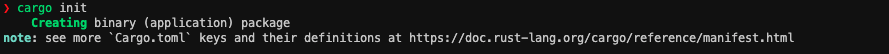
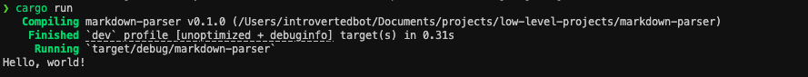

So, today we are going to build a markdown parser using Rust programming language. Our goal is to build a markdown parser to learn about parsing concepts and not to build a production grade markdown parser.
We are also going to learn rust from beginning while building this project so you don't need to have any experience in rust programming language.

## Prerequisites
- Familiarity with any one programming language
- A code editor
- Rust and rust plugins or extensions for your ide should be installed.

## Setup
Lets start by setting up the project with rust.
- First, lets create a folder with the name `markdown-parser`.
- Open this directory in your code editor, I'll be using VSCode but you can use whatever you want.
- Make sure you have installed `rust` in your system and its plugins or extensions for your editor.
- Open your terminal and go to the project directory and execute the following command -> `cargo init`



After running the command you'll see there are some new files and folders created.
Let's look at each of them and understand what are they.

- `Cargo.toml` -> This file contains the metadata about the project (its name, version, cargo edition, dependencies and so on)
- `.gitignore` -> The above command creates the structure of the project and initializes a git repository, hence we have a `.gitignore` file too.
- `src` folder -> This folder contains all the code that we are going to write and execute.
- `src/main.rs` -> This is the entry point of our code, we will understand more about it later but for now you can see there is a simple hello world code. Now, lets compile and run the code to see what are we getting as output.


You can see that it is first compiling the project, then created a development build (not a release build or optimised build) and then started running the project from the `target` folder. Finally it prints out `Hello World`.

> [!Note] Target Directory
> In a rust project that uses cargo to manage its dependencies, you'll always get a target directory where it'll keep its dev and prod builds. When you execute the command `cargo run` it'll create a dev or debug build and run that. If you want to have a production or release build then you can run `cargo build`.

Let's now experiment with the `main.rs` code and instead of printing `Hello World!`, lets try to print something else like our project title.

### Modifying `main.rs` to print project title
```rust
fn main() {
    println!("Starting our Markdown Parser project!");
    println!("This is going to be awesome!");
}
```

Let's understand what is happening in this code.
- The first line defines a function named `main` and to define a function in rust we use the keyword `fn`.
- The second line is using the `println!` macro to print the text on the screen.
- The third line is using the same macro to print another text on the screen.

> [!Note] If you are coming from python
> In rust we end each statement with a semicolon and that is required otherwise it'll throw a compilation error.
> In rust we use curly brace `{ }` to start and end a function body instead of relying on indentation.

Now you might be wondering what is a macro? It seems like a function and works like a print function.
For now, lets not get into that, I'll explain that later as it might get complicated if you are new to rust. For now, just think of them as function but as we will continue to work more and more on this project, I'll explain what macro exactly is and how we can create our own macros.

## Conclusion
I hope you are excited as I'm for this series and you'll continue to show up for the rest of the series and build your own markdown parser and most importantly learn something new and exciting. In the next post, we will start working on our markdown parser. See you soon.
