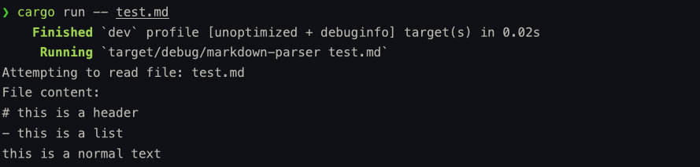

In this post, we will implement a command line interface that'll accept a markdown file as a command line argument, read its content and print the entire content of the file in the terminal.

After doing this we will be well on our way to start implementing parsing basic texts, headers, lists and so on.

I'll explain all the code in detail and in the end, I'll give you the entire code so that you can try without any issues.

## Required Modules
There are two modules that we need to use:
- `std::env` - we need `env` module for interacting with the environment the program is currently running in. Now, we use it here to access the command-line arguments passed to our program.
- `std::fs` - we need `fs` for file operations like reading from and writing to files.

```rust
use std::env;
use std::fs;
```

## Getting the markdown file from command line
After getting the required modules, we can start working on getting the markdown file from the command line argument.
From now on, we will write every line of code inside the main function.

```rust
let args: Vec<String> = env::args().collect();
```

Let's understand what this line does.
- `env::args()` - this function returns an iterator of the arguments provided in the command line to the program.
- `collect()` - then we are are using the collect() method to consume the iterator and collect all the items from that iterator into a collection.
- `Vec<String>` - To store all the items from the iterator we are using the Vector collection that stores elements of type `String`. We gave the variable name of this `Vec<String>` as `args`. So, this `args` is holding all the items from that command line iterator.

Now, let's handle the case where user either knowingly or unknowingly skips giving the markdown file in the command line argument. In this case, we need to ask the user to provide a markdown file.

```rust
if args.len() < 2 {
		println!("Please provide a markdown file");
		return;
}
```

Here, we are saying if the number of commands is less than 2, then print a statement asking user to provide a markdown file and then return from the program.

> [!Note] Number of Arguments
> In command line, the first argument is the program's name. We need another argument that'll represent the filename. Hence, we need the length of the `args` to be at least 2.

## Reading the file and print its content
Now lets store the filename that we got from the command line argument.
```rust
let filename = &args[1];
```

We are creating a variable `filename` and storing the filename from the 2nd command line argument.

Now, lets start reading the raw content of the file and print the entire content as it is.

```rust
println!("Attempting to read file: {}", filename);
let content = fs::read_to_string(filename).expect("Something went wrong reading the file");
println!("File content:\n{}", content);
```

- First, we are just printing a logging statement to know that we are attempting to read the file.
- `fs::read_to_string(filename)` - this function comes from the `fs` module that reads the entire content of the file specified by the filename.
- Then, we are storing the entire content in the `content` variable and finally printing out the entire content on the console.

Before explaining `expect()` method, lets understand a specific data type in rust.

## `Result` in Rust
In Rust, the way we handle operations that might fail is by using `Result` type. It's an enum with two variants:
```rust
enum Result<T, E> {
    Ok(T),    // Success - contains the value of type T
    Err(E),   // Error - contains the error of type E
}
```

Now, lets get back to the `fs::read_to_string()` function.
If you'll look in the docs, it returns a `Result` type and for a success case it returns a `String` type and for failure case it returns a `std::io::Error` type.

Now, lets connect this with the `expect()` method.

This `expect()` method is a shortcut that says:
- if `fs::read_to_string()` works fine and returns `Ok(string)`, then return the string value.
- if `fs::read_to_string()` doesn't work, then crash the program with the custom error message ("Something went wrong reading the file").

## Testing the Program
To test, lets create a `test.md` file in the root of the project and put some random markdown text.
```md
# this is a header
- this is a list
this is a normal text
```

Now, open your terminal from your project directory and type the command:
```rust
cargo run -- test.md
```

It'll compile and execute the code and give you the following output.


This output shows that we can successfully get the markdown file's content and print their raw data. In the next post we will start to learn about parsing.

## Complete Source Code
```rust
use std::env;
use std::fs;

fn main() {
    let args: Vec<String> = env::args().collect();

    if args.len() < 2 {
        println!("Please provide a markdown file");
        return;
    }

    let filename = &args[1];

    println!("Attempting to read file: {}", filename);

    let content = fs::read_to_string(filename).expect("Something went wrong reading the file");

    println!("File content:\n{}", content);
}
```


## Conclusion
In this post, we understood how to interact with the command line and also read the markdown file from command line argument. We also understood basic error handling using `Result` where we know things might go wrong and we made sure that our program can handle that.

Now, that we understood reading and printing all the markdown file content. From the next post, we are slowly going to implement our parsing algorithm step by step and cover basic text, headers, list and other things one by one. I'm really excited for the next post, I hope you are excited too. See you soon.
